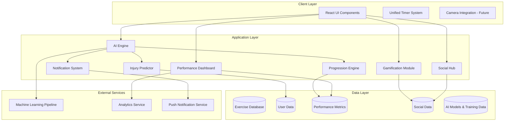

# Design Document: Advanced Exercise System

## Overview

The Advanced Exercise System transforms the existing MaxNutrition exercise platform into the world's most intelligent and engaging fitness system. By integrating AI-driven adaptation, comprehensive gamification, predictive injury prevention, social features, and advanced analytics, we create a holistic ecosystem that evolves with each user's journey.

## Architecture

### High-Level Architecture



### System Components

#### 1. AI Engine (Core Intelligence)
- **Real-time Adaptation**: Analyzes user performance, fatigue, and environmental factors
- **Learning Pipeline**: Continuously improves recommendations based on user feedback
- **Context Awareness**: Considers time of day, weather, stress levels, and historical patterns
- **Safety First**: Prioritizes user safety and injury prevention in all decisions

#### 2. Gamification Module
- **Achievement System**: Dynamic badges, streaks, and milestone rewards
- **Point Economy**: Sophisticated scoring system with multipliers and bonuses
- **Challenge Engine**: Creates personalized and group challenges
- **Leaderboards**: Multiple ranking systems (friends, global, age groups)

#### 3. Progression Engine
- **Adaptive Loading**: Automatically adjusts weights, reps, and intensity
- **Plateau Detection**: Identifies stagnation and introduces variations
- **Goal Alignment**: Tailors progression to user's specific objectives
- **Balance Monitoring**: Ensures proportional development across muscle groups

#### 4. Injury Predictor
- **Pattern Analysis**: Monitors training load, recovery, and pain reports
- **Risk Assessment**: Calculates injury probability using ML models
- **Preventive Interventions**: Suggests modifications before problems occur
- **Recovery Protocols**: Provides evidence-based recovery strategies

#### 5. Social Hub
- **Group Workouts**: Real-time shared exercise sessions
- **Buddy System**: Intelligent matching based on compatibility
- **Community Challenges**: Large-scale competitions and events
- **Virtual Training**: Professional trainer integration

#### 6. Performance Dashboard
- **Advanced Analytics**: Comprehensive metrics and trend analysis
- **Predictive Insights**: Goal achievement timelines and recommendations
- **Comparative Analysis**: Benchmarking against similar users
- **Export Capabilities**: Professional reports for healthcare providers

## Components and Interfaces

### AI Engine Interface

```typescript
interface AIEngine {
  analyzeUserState(userId: string, contextData: ContextData): Promise<UserAnalysis>;
  adaptWorkout(workoutPlan: WorkoutPlan, userState: UserState): Promise<AdaptedWorkout>;
  processUserFeedback(feedback: UserFeedback): Promise<void>;
  predictOptimalTiming(userId: string): Promise<OptimalTiming>;
  generateRecommendations(userId: string, goals: UserGoals): Promise<Recommendation[]>;
}

interface ContextData {
  timeOfDay: string;
  weather?: WeatherData;
  stressLevel: number;
  sleepQuality: number;
  recentPerformance: PerformanceMetric[];
}

interface UserAnalysis {
  energyLevel: number;
  readiness: number;
  riskFactors: RiskFactor[];
  recommendations: string[];
}
```

### Gamification Module Interface

```typescript
interface GamificationModule {
  awardPoints(userId: string, activity: Activity, performance: Performance): Promise<PointsAwarded>;
  checkAchievements(userId: string, newData: ActivityData): Promise<Achievement[]>;
  createChallenge(type: ChallengeType, participants: string[], config: ChallengeConfig): Promise<Challenge>;
  updateLeaderboards(timeframe: TimeFrame): Promise<void>;
  generateMotivationalContent(userId: string, context: MotivationContext): Promise<MotivationalMessage>;
}

interface PointsAwarded {
  basePoints: number;
  bonusPoints: number;
  multiplier: number;
  totalPoints: number;
  reason: string;
}
```

### Progression Engine Interface

```typescript
interface ProgressionEngine {
  analyzePerformance(userId: string, exerciseId: string, metrics: PerformanceMetric[]): Promise<ProgressionAnalysis>;
  calculateNextProgression(currentLevel: ExerciseLevel, performance: PerformanceHistory): Promise<ExerciseLevel>;
  detectPlateau(userId: string, exerciseId: string, timeframe: number): Promise<PlateauAnalysis>;
  balanceProgression(userId: string, muscleGroups: MuscleGroup[]): Promise<BalanceRecommendation>;
  explainProgression(change: ProgressionChange): string;
}

interface ProgressionAnalysis {
  currentCapacity: number;
  recommendedIncrease: number;
  confidenceLevel: number;
  reasoning: string[];
}
```

### Injury Predictor Interface

```typescript
interface InjuryPredictor {
  assessRisk(userId: string, workoutPlan: WorkoutPlan): Promise<RiskAssessment>;
  monitorPatterns(userId: string, timeframe: number): Promise<PatternAnalysis>;
  suggestPrevention(riskFactors: RiskFactor[]): Promise<PreventionPlan>;
  analyzeRecovery(userId: string, recoveryData: RecoveryMetrics): Promise<RecoveryAnalysis>;
  integrateHolisticData(userId: string): Promise<HolisticHealth>;
}

interface RiskAssessment {
  overallRisk: number;
  specificRisks: SpecificRisk[];
  recommendations: PreventionAction[];
  urgency: 'low' | 'medium' | 'high' | 'critical';
}
```

## Data Models

### Core Exercise Data

```typescript
interface Exercise {
  id: string;
  code: string;
  name: string;
  level: 1 | 2 | 3 | 4;
  category: 'A' | 'B' | 'C' | 'D' | 'E';
  muscleGroup: string[];
  equipment: string[];
  location: 'casa' | 'academia';
  reps: string;
  sets: number;
  restTime: number;
  calories: number;
  instructions: string[];
  tips: string[];
  variations: ExerciseVariation[];
  riskFactors: RiskFactor[];
  adaptations: ExerciseAdaptation[];
}

interface ExerciseVariation {
  id: string;
  name: string;
  difficulty: number;
  equipment: string[];
  modifications: string[];
}
```

### User Performance Data

```typescript
interface UserPerformance {
  userId: string;
  exerciseId: string;
  sessionId: string;
  timestamp: Date;
  metrics: {
    weight?: number;
    reps: number;
    sets: number;
    duration: number;
    restTime: number;
    heartRate?: number[];
    difficultyRating: number;
    fatigueLevel: number;
    painLevel: number;
    enjoymentRating: number;
  };
  environmentalFactors: {
    timeOfDay: string;
    temperature?: number;
    humidity?: number;
    stressLevel: number;
  };
  adaptations: ExerciseAdaptation[];
}
```

### Gamification Data

```typescript
interface UserGamification {
  userId: string;
  totalPoints: number;
  level: number;
  achievements: Achievement[];
  streaks: Streak[];
  challenges: UserChallenge[];
  leaderboardPositions: LeaderboardPosition[];
  preferences: GamificationPreferences;
}

interface Achievement {
  id: string;
  name: string;
  description: string;
  category: AchievementCategory;
  points: number;
  rarity: 'common' | 'rare' | 'epic' | 'legendary';
  unlockedAt: Date;
  progress: number;
  maxProgress: number;
}
```

### Social Data

```typescript
interface SocialGroup {
  id: string;
  name: string;
  description: string;
  members: GroupMember[];
  challenges: GroupChallenge[];
  settings: GroupSettings;
  createdAt: Date;
  isActive: boolean;
}

interface GroupMember {
  userId: string;
  role: 'owner' | 'admin' | 'member';
  joinedAt: Date;
  stats: MemberStats;
  preferences: SocialPreferences;
}
```

## Correctness Properties

*A property is a characteristic or behavior that should hold true across all valid executions of a system—essentially, a formal statement about what the system should do. Properties serve as the bridge between human-readable specifications and machine-verifiable correctness guarantees.*

### AI Engine Properties

**Property 1: Workout Adaptation Consistency**
*For any* user workout session, when the AI Engine analyzes performance data and current state, the resulting workout adaptations should be consistent with the user's safety parameters and fitness level
**Validates: Requirements 1.1, 1.2, 1.3**

**Property 2: Safety-First Adaptation**
*For any* user with heart rate exceeding safe zones or reporting pain/fatigue, the AI Engine should always prioritize safety by reducing intensity or suggesting rest over maintaining workout difficulty
**Validates: Requirements 1.4, 1.5**

**Property 3: Learning Convergence**
*For any* consistent pattern of user feedback, the AI Engine should demonstrate measurable improvement in recommendation accuracy over time
**Validates: Requirements 1.6**

**Property 4: Environmental Responsiveness**
*For any* significant change in environmental factors (time, weather, stress), the AI Engine should adjust workout recommendations in a predictable and beneficial direction
**Validates: Requirements 1.7**

### Gamification Properties

**Property 5: Point Calculation Consistency**
*For any* completed workout, consistency streak, or personal record, the Gamification Module should award points according to a deterministic formula that rewards effort and achievement proportionally
**Validates: Requirements 2.1, 2.3**

**Property 6: Achievement Unlock Reliability**
*For any* user reaching defined milestone criteria (like 7 consecutive workout days), the corresponding achievements should be unlocked exactly once and at the correct time
**Validates: Requirements 2.2, 2.7**

**Property 7: Challenge Progression Fairness**
*For any* generated challenge, the difficulty should be appropriate for the target participants' fitness levels and show progressive increase over time
**Validates: Requirements 2.4**

**Property 8: Social Tracking Accuracy**
*For any* group challenge or social activity, all participant progress should be tracked accurately and rankings should reflect actual performance
**Validates: Requirements 2.5, 2.6**

### Progression Engine Properties

**Property 9: Performance Tracking Completeness**
*For any* exercise session, all relevant performance metrics (reps, weight, time, difficulty rating) should be captured and stored correctly
**Validates: Requirements 3.1**

**Property 10: Adaptive Difficulty Adjustment**
*For any* user showing consistent ease (rating 1-4/10) or struggle (rating 9-10/10) with exercises, the Progression Engine should adjust difficulty in the appropriate direction
**Validates: Requirements 3.2, 3.3**

**Property 11: Recovery-Based Rest Optimization**
*For any* user's recovery patterns and heart rate data, rest time adjustments should correlate positively with recovery needs and negatively with overexertion indicators
**Validates: Requirements 3.4**

**Property 12: Plateau Detection and Response**
*For any* user showing performance stagnation for 2+ weeks, the Progression Engine should introduce appropriate exercise variations or new movements
**Validates: Requirements 3.5**

**Property 13: Muscle Group Balance Maintenance**
*For any* user's progression across muscle groups, the system should detect and correct imbalances by adjusting training emphasis
**Validates: Requirements 3.6**

**Property 14: Goal-Aligned Progression**
*For any* user with specific goals (strength, endurance, weight loss), progression adaptations should prioritize exercises and parameters that support those goals
**Validates: Requirements 3.7**

### Injury Predictor Properties

**Property 15: Overtraining Detection Sensitivity**
*For any* user showing patterns of excessive frequency, intensity, or insufficient recovery, the Injury Predictor should detect overtraining risk and suggest appropriate interventions
**Validates: Requirements 4.2**

**Property 16: Imbalance Correction Recommendations**
*For any* detected muscle imbalances in training patterns, the Injury Predictor should recommend specific corrective exercises that address the imbalance
**Validates: Requirements 4.3**

**Property 17: Pain Pattern Correlation**
*For any* user pain reports, the system should identify correlations with specific exercises or training patterns and suggest appropriate modifications
**Validates: Requirements 4.4, 4.7**

**Property 18: High-Risk Automatic Intervention**
*For any* user with calculated high injury risk, workout plans should be automatically modified to reduce risk factors
**Validates: Requirements 4.5**

**Property 19: Holistic Health Integration**
*For any* user with available sleep, stress, and nutrition data, the injury risk assessment should incorporate all relevant factors for comprehensive analysis
**Validates: Requirements 4.8**

### Social Hub Properties

**Property 20: Group Functionality Reliability**
*For any* workout group creation or joining operation, all members should have consistent access to group features and real-time sharing capabilities
**Validates: Requirements 5.1, 5.2**

**Property 21: Team Challenge Coordination**
*For any* team challenge, shared goals should be tracked accurately and progress should be visible to all participants in real-time
**Validates: Requirements 5.3, 5.4**

**Property 22: Buddy Matching Optimization**
*For any* user seeking a workout buddy, matches should be based on compatible fitness levels, goals, and preferences
**Validates: Requirements 5.6**

**Property 23: Motivational Support Delivery**
*For any* user showing decreased motivation or engagement, appropriate encouragement should be delivered from friends and community
**Validates: Requirements 5.7**

### Performance Dashboard Properties

**Property 24: Comprehensive Statistics Display**
*For any* user's workout history, the dashboard should accurately calculate and display strength gains, endurance improvements, and consistency metrics
**Validates: Requirements 6.1, 6.2**

**Property 25: Predictive Timeline Accuracy**
*For any* user's current progress rate and goals, timeline predictions should be based on realistic projections and historical data
**Validates: Requirements 6.3**

**Property 26: Pattern-Based Insight Generation**
*For any* identifiable patterns in user data, the dashboard should generate relevant and actionable insights and recommendations
**Validates: Requirements 6.4**

**Property 27: Benchmark Comparison Validity**
*For any* user profile, progress comparisons should be made against appropriately similar and anonymized user groups
**Validates: Requirements 6.5**

**Property 28: Achievement Celebration Consistency**
*For any* user milestone achievement, appropriate visual feedback and celebration should be provided consistently
**Validates: Requirements 6.7**

### System Integration Properties

**Property 29: Backward Compatibility Preservation**
*For any* existing exercise in the 257-exercise database, all functionality should remain accessible and compatible with new features
**Validates: Requirements 7.1, 7.3**

**Property 30: Data Migration Integrity**
*For any* user with existing workout programs and data, activation of new features should preserve all information without loss or corruption
**Validates: Requirements 7.2, 7.4**

**Property 31: System Upgrade Seamlessness**
*For any* user accessing the system during feature upgrades, the transition should be smooth and intuitive without breaking existing workflows
**Validates: Requirements 7.7**

### Notification System Properties

**Property 32: Optimal Timing Delivery**
*For any* user's established workout patterns and preferences, notifications should be sent at times that maximize engagement and minimize disruption
**Validates: Requirements 8.1**

**Property 33: Adaptive Frequency Management**
*For any* user's engagement level and notification preferences, the frequency of notifications should adapt to maintain effectiveness without causing annoyance
**Validates: Requirements 8.5**

**Property 34: Critical Alert Immediacy**
*For any* detected injury risk or safety concern, immediate alerts with preventive actions should be sent without delay
**Validates: Requirements 8.8**

### Learning System Properties

**Property 35: Feedback Integration Effectiveness**
*For any* user feedback (ratings, comments, behavior), the system should demonstrate measurable improvement in future recommendations
**Validates: Requirements 9.2, 9.4**

**Property 36: Preference Learning Accuracy**
*For any* user's exercise preferences (enjoyment, skipping patterns), the system should accurately track and incorporate these preferences into future recommendations
**Validates: Requirements 9.3**

**Property 37: Continuous Model Improvement**
*For any* aggregated user data over time, AI models should show measurable improvement in prediction accuracy and recommendation quality
**Validates: Requirements 9.6**

**Property 38: Recommendation Transparency**
*For any* system recommendation or adaptation, clear explanations should be provided that help users understand the reasoning behind decisions
**Validates: Requirements 3.8, 9.8**

## Error Handling

### AI Engine Error Handling
- **Fallback Mechanisms**: When AI analysis fails, revert to rule-based recommendations
- **Data Validation**: Ensure all input data is validated before processing
- **Graceful Degradation**: System continues functioning with reduced intelligence if AI services are unavailable
- **User Safety**: Always err on the side of caution when AI recommendations are uncertain

### Performance Monitoring
- **Real-time Metrics**: Monitor AI response times and accuracy
- **A/B Testing**: Continuously test AI improvements against baseline performance
- **User Feedback Integration**: Use negative feedback to improve AI models
- **Anomaly Detection**: Identify and handle unusual user behavior or data patterns

### Data Consistency
- **Transaction Management**: Ensure data consistency across all modules
- **Conflict Resolution**: Handle conflicts between different system recommendations
- **Backup Strategies**: Maintain data backups and recovery procedures
- **Synchronization**: Keep all user data synchronized across devices and sessions

## Testing Strategy

### Dual Testing Approach
The system requires both unit testing and property-based testing to ensure comprehensive coverage:

**Unit Tests:**
- Test specific examples and edge cases for each component
- Verify integration points between AI Engine, Gamification, and other modules
- Test error conditions and boundary cases
- Validate API contracts and data transformations

**Property-Based Tests:**
- Verify universal properties across all inputs using randomized testing
- Test AI adaptation consistency across various user profiles and scenarios
- Validate gamification fairness across different user behaviors
- Ensure progression engine balance across all muscle groups and fitness levels
- Minimum 100 iterations per property test due to randomization

**Property Test Configuration:**
Each property test must reference its design document property and run with sufficient iterations:
- **Feature: advanced-exercise-system, Property 1**: Workout Adaptation Consistency
- **Feature: advanced-exercise-system, Property 2**: Safety-First Adaptation
- And so forth for all 38 properties

**Integration Testing:**
- End-to-end user journey testing from onboarding to advanced features
- Cross-module interaction testing (AI + Gamification + Social)
- Performance testing under various load conditions
- Real-time feature testing (notifications, social interactions)

**Machine Learning Testing:**
- Model accuracy validation using historical data
- A/B testing for AI recommendation improvements
- Bias detection and fairness testing across user demographics
- Continuous monitoring of model performance in production