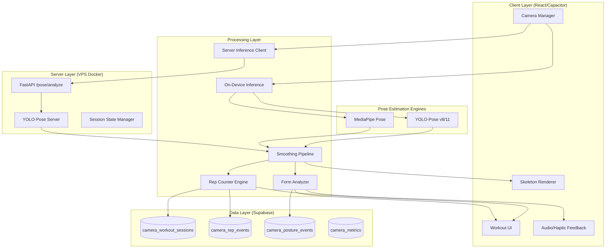

# Design Document: Camera Workout with Pose Estimation

## Overview

O módulo "Treino com Câmera" transforma o MaxNutrition no app de fitness mais avançado do mundo, utilizando YOLO-Pose e MediaPipe para pose estimation em tempo real. O sistema detecta automaticamente movimentos, conta repetições, fornece feedback de postura gentil e gamifica a experiência. Projetado para ser tolerante a erros e inclusivo para usuários iniciantes e obesos.

## Architecture

### High-Level Architecture



### Dual-Mode Architecture

```
┌─────────────────────────────────────────────────────────────────┐
│                    CAMERA WORKOUT SYSTEM                        │
├─────────────────────────────────────────────────────────────────┤
│                                                                 │
│  ┌─────────────────┐    ┌─────────────────┐                    │
│  │   MODE 1:       │    │   MODE 2:       │                    │
│  │   ON-DEVICE     │    │   SERVER        │                    │
│  │   (Preferred)   │    │   (Fallback)    │                    │
│  ├─────────────────┤    ├─────────────────┤                    │
│  │ • YOLO-Pose     │    │ • VPS Docker    │                    │
│  │ • MediaPipe     │    │ • 45.67.221.216 │                    │
│  │ • 30 FPS        │    │ • ~15 FPS       │                    │
│  │ • <50ms latency │    │ • ~200ms latency│                    │
│  │ • No network    │    │ • Requires WiFi │                    │
│  └─────────────────┘    └─────────────────┘                    │
│                                                                 │
│  ┌─────────────────────────────────────────────────────────────┐│
│  │              SHARED PROCESSING PIPELINE                     ││
│  │  Keypoints → Smoothing → Angle Calc → Rep Count → Feedback ││
│  └─────────────────────────────────────────────────────────────┘│
│                                                                 │
└─────────────────────────────────────────────────────────────────┘
```

## Components and Interfaces

### 1. Camera Manager Interface

```typescript
interface CameraManager {
  initialize(): Promise<CameraState>;
  startCapture(config: CameraConfig): Promise<void>;
  stopCapture(): void;
  switchCamera(): Promise<void>;
  getFrame(): ImageData;
  onFrame(callback: (frame: ImageData) => void): void;
  getStats(): CameraStats;
}

interface CameraConfig {
  resolution: 'low' | 'medium' | 'high'; // 320p, 480p, 720p
  targetFPS: number; // 15-30
  facingMode: 'user' | 'environment';
  autoOptimize: boolean;
}

interface CameraStats {
  currentFPS: number;
  resolution: { width: number; height: number };
  batteryImpact: 'low' | 'medium' | 'high';
  temperature: number;
}
```

### 2. Pose Estimator Interface

```typescript
interface PoseEstimator {
  initialize(mode: InferenceMode): Promise<void>;
  detectPose(frame: ImageData): Promise<PoseResult>;
  getConfidence(): number;
  switchMode(mode: InferenceMode): Promise<void>;
  dispose(): void;
}

type InferenceMode = 'yolo-pose' | 'mediapipe' | 'server';

interface PoseResult {
  keypoints: Keypoint[];
  confidence: number;
  inferenceTime: number;
  boundingBox: BoundingBox;
  isFullBody: boolean;
}

interface Keypoint {
  id: KeypointId;
  name: string;
  x: number; // normalized 0-1
  y: number; // normalized 0-1
  confidence: number;
  worldX?: number; // 3D coordinates (MediaPipe)
  worldY?: number;
  worldZ?: number;
}

// COCO 17 Keypoints
type KeypointId = 
  | 'nose' | 'left_eye' | 'right_eye' | 'left_ear' | 'right_ear'
  | 'left_shoulder' | 'right_shoulder' | 'left_elbow' | 'right_elbow'
  | 'left_wrist' | 'right_wrist' | 'left_hip' | 'right_hip'
  | 'left_knee' | 'right_knee' | 'left_ankle' | 'right_ankle';
```

### 3. Rep Counter Interface

```typescript
interface RepCounter {
  initialize(exercise: ExerciseType, calibration: CalibrationData): void;
  processFrame(keypoints: Keypoint[]): RepCountResult;
  reset(): void;
  getStats(): RepStats;
}

interface RepCountResult {
  totalReps: number;
  currentPhase: 'up' | 'down' | 'transition' | 'rest';
  phaseProgress: number; // 0-100%
  isValidRep: boolean;
  partialReps: number;
  lastRepQuality: number; // 0-100
  angles: ExerciseAngles;
}

interface ExerciseAngles {
  primary: number; // Main angle for the exercise (e.g., knee for squat)
  secondary?: number; // Secondary angle (e.g., hip for squat)
  tertiary?: number; // Additional angle if needed
}

interface RepStats {
  totalReps: number;
  validReps: number;
  partialReps: number;
  averageQuality: number;
  bestRep: number;
  worstRep: number;
  duration: number;
}

type ExerciseType = 'squat' | 'pushup' | 'situp' | 'plank' | 'lunge' | 'jumpingJack';
```

### 4. Form Analyzer Interface

```typescript
interface FormAnalyzer {
  initialize(exercise: ExerciseType, userLevel: FitnessLevel): void;
  analyzeForm(keypoints: Keypoint[], angles: ExerciseAngles): FormAnalysis;
  getRecommendations(): FormRecommendation[];
}

interface FormAnalysis {
  overallScore: number; // 0-100
  issues: FormIssue[];
  improvements: string[];
  isInSafeZone: boolean;
}

interface FormIssue {
  type: FormIssueType;
  severity: 'minor' | 'moderate' | 'significant';
  message: string; // Always positive/encouraging
  correction: string;
  affectedKeypoints: KeypointId[];
}

type FormIssueType = 
  | 'knee_over_toes' | 'back_rounding' | 'depth_insufficient'
  | 'asymmetry' | 'speed_too_fast' | 'range_limited';

type FitnessLevel = 'beginner' | 'intermediate' | 'advanced';

// Mensagens sempre positivas e encorajadoras
const FORM_MESSAGES: Record<FormIssueType, { minor: string; moderate: string; significant: string }> = {
  knee_over_toes: {
    minor: "Ótimo! Tente manter os joelhos um pouquinho mais atrás",
    moderate: "Você está indo bem! Foque em empurrar o quadril para trás",
    significant: "Vamos ajustar: sente-se para trás como se fosse sentar numa cadeira"
  },
  back_rounding: {
    minor: "Quase perfeito! Mantenha o peito erguido",
    moderate: "Bom trabalho! Olhe para frente para ajudar a postura",
    significant: "Você consegue! Imagine um fio puxando seu peito para cima"
  },
  depth_insufficient: {
    minor: "Excelente! Tente descer só mais um pouquinho",
    moderate: "Muito bom! Vá até onde for confortável, cada vez mais fundo",
    significant: "Continue assim! A flexibilidade vem com a prática"
  },
  // ... mais mensagens
};
```

### 5. Calibration System Interface

```typescript
interface CalibrationSystem {
  startCalibration(): Promise<void>;
  processCalibrationFrame(keypoints: Keypoint[]): CalibrationProgress;
  completeCalibration(): CalibrationData;
  validateEnvironment(): EnvironmentCheck;
}

interface CalibrationData {
  standingHeight: number;
  shoulderWidth: number;
  hipWidth: number;
  naturalKneeAngle: number;
  naturalHipAngle: number;
  rangeOfMotion: {
    squat: { min: number; max: number };
    // ... outros exercícios
  };
  thresholds: {
    repDownAngle: number;
    repUpAngle: number;
    safeZoneTolerance: number;
  };
  timestamp: Date;
}

interface EnvironmentCheck {
  lighting: 'good' | 'fair' | 'poor';
  distance: 'too_close' | 'optimal' | 'too_far';
  visibility: 'full_body' | 'partial' | 'obstructed';
  stability: 'stable' | 'shaky';
  recommendations: string[];
}
```

### 6. Server Inference API Interface

```typescript
// FastAPI endpoint: POST /pose/analyze
interface PoseAnalyzeRequest {
  frame: string; // base64 encoded image
  sessionId: string;
  exercise: ExerciseType;
  calibration?: CalibrationData;
}

interface PoseAnalyzeResponse {
  keypoints: Keypoint[];
  repCount: number;
  currentPhase: 'up' | 'down' | 'transition';
  formHints: FormHint[];
  confidence: number;
  warnings: string[];
  inferenceTimeMs: number;
  angles: ExerciseAngles;
}

interface FormHint {
  type: FormIssueType;
  message: string;
  priority: number;
}
```


## Data Models

### Supabase Tables

```sql
-- Sessões de treino com câmera
CREATE TABLE camera_workout_sessions (
  id UUID PRIMARY KEY DEFAULT gen_random_uuid(),
  user_id UUID REFERENCES auth.users(id) ON DELETE CASCADE,
  exercise_type TEXT NOT NULL, -- 'squat', 'pushup', etc.
  started_at TIMESTAMPTZ DEFAULT NOW(),
  ended_at TIMESTAMPTZ,
  duration_seconds INTEGER,
  total_reps INTEGER DEFAULT 0,
  valid_reps INTEGER DEFAULT 0,
  partial_reps INTEGER DEFAULT 0,
  average_form_score DECIMAL(5,2),
  best_rep_score DECIMAL(5,2),
  inference_mode TEXT, -- 'on-device', 'server'
  device_info JSONB,
  calibration_data JSONB,
  points_earned INTEGER DEFAULT 0,
  xp_earned INTEGER DEFAULT 0,
  created_at TIMESTAMPTZ DEFAULT NOW()
);

-- Eventos de repetição individual
CREATE TABLE camera_rep_events (
  id UUID PRIMARY KEY DEFAULT gen_random_uuid(),
  session_id UUID REFERENCES camera_workout_sessions(id) ON DELETE CASCADE,
  rep_number INTEGER NOT NULL,
  timestamp TIMESTAMPTZ DEFAULT NOW(),
  duration_ms INTEGER,
  form_score DECIMAL(5,2),
  angles JSONB, -- { primary: 85, secondary: 120 }
  phase_durations JSONB, -- { down: 800, up: 600 }
  is_valid BOOLEAN DEFAULT true,
  issues TEXT[],
  keypoints_snapshot JSONB -- Snapshot dos keypoints no momento da rep
);

-- Eventos de postura/feedback
CREATE TABLE camera_posture_events (
  id UUID PRIMARY KEY DEFAULT gen_random_uuid(),
  session_id UUID REFERENCES camera_workout_sessions(id) ON DELETE CASCADE,
  timestamp TIMESTAMPTZ DEFAULT NOW(),
  issue_type TEXT NOT NULL,
  severity TEXT, -- 'minor', 'moderate', 'significant'
  message_shown TEXT,
  user_improved BOOLEAN DEFAULT false,
  keypoints_at_issue JSONB
);

-- Métricas de performance do sistema
CREATE TABLE camera_metrics (
  id UUID PRIMARY KEY DEFAULT gen_random_uuid(),
  session_id UUID REFERENCES camera_workout_sessions(id) ON DELETE CASCADE,
  timestamp TIMESTAMPTZ DEFAULT NOW(),
  fps DECIMAL(5,2),
  inference_latency_ms INTEGER,
  confidence_avg DECIMAL(5,4),
  lighting_quality TEXT,
  visibility_score DECIMAL(5,2),
  device_temperature DECIMAL(5,2),
  battery_level INTEGER,
  errors TEXT[]
);

-- Calibrações salvas do usuário
CREATE TABLE camera_calibrations (
  id UUID PRIMARY KEY DEFAULT gen_random_uuid(),
  user_id UUID REFERENCES auth.users(id) ON DELETE CASCADE,
  exercise_type TEXT NOT NULL,
  calibration_data JSONB NOT NULL,
  created_at TIMESTAMPTZ DEFAULT NOW(),
  last_used_at TIMESTAMPTZ,
  UNIQUE(user_id, exercise_type)
);

-- Índices para performance
CREATE INDEX idx_camera_sessions_user ON camera_workout_sessions(user_id, started_at DESC);
CREATE INDEX idx_camera_reps_session ON camera_rep_events(session_id, rep_number);
CREATE INDEX idx_camera_posture_session ON camera_posture_events(session_id, timestamp);
CREATE INDEX idx_camera_metrics_session ON camera_metrics(session_id, timestamp);
```


### TypeScript Data Types

```typescript
// Sessão de treino com câmera
interface CameraWorkoutSession {
  id: string;
  userId: string;
  exerciseType: ExerciseType;
  startedAt: Date;
  endedAt?: Date;
  durationSeconds: number;
  totalReps: number;
  validReps: number;
  partialReps: number;
  averageFormScore: number;
  bestRepScore: number;
  inferenceMode: 'on-device' | 'server';
  deviceInfo: DeviceInfo;
  calibrationData: CalibrationData;
  pointsEarned: number;
  xpEarned: number;
}

// Evento de repetição
interface CameraRepEvent {
  id: string;
  sessionId: string;
  repNumber: number;
  timestamp: Date;
  durationMs: number;
  formScore: number;
  angles: ExerciseAngles;
  phaseDurations: { down: number; up: number };
  isValid: boolean;
  issues: FormIssueType[];
  keypointsSnapshot?: Keypoint[];
}

// Configuração de exercício para pose estimation
interface ExerciseConfig {
  type: ExerciseType;
  name: string;
  namePt: string;
  primaryKeypoints: KeypointId[];
  secondaryKeypoints: KeypointId[];
  angleCalculation: AngleCalculation;
  thresholds: ExerciseThresholds;
  formRules: FormRule[];
  calibrationPose: string;
  tutorialSteps: TutorialStep[];
}

interface ExerciseThresholds {
  repDownAngle: number; // Ângulo para considerar "desceu"
  repUpAngle: number; // Ângulo para considerar "subiu"
  safeZoneTolerance: number; // Tolerância em graus
  minRepDuration: number; // ms - evita contagem rápida demais
  maxRepDuration: number; // ms - detecta rep muito lenta
  debounceTime: number; // ms - entre reps
}

interface AngleCalculation {
  type: 'three-point' | 'two-point' | 'vertical';
  points: [KeypointId, KeypointId, KeypointId?];
  invert?: boolean;
}
```

## Exercise Configurations (MVP: Squat)

```typescript
const SQUAT_CONFIG: ExerciseConfig = {
  type: 'squat',
  name: 'Squat',
  namePt: 'Agachamento',
  primaryKeypoints: ['left_hip', 'left_knee', 'left_ankle', 'right_hip', 'right_knee', 'right_ankle'],
  secondaryKeypoints: ['left_shoulder', 'right_shoulder', 'nose'],
  angleCalculation: {
    type: 'three-point',
    points: ['left_hip', 'left_knee', 'left_ankle'], // Ângulo do joelho
  },
  thresholds: {
    repDownAngle: 90, // Joelho a 90° = agachamento completo
    repUpAngle: 160, // Joelho a 160° = em pé
    safeZoneTolerance: 15, // ±15° de tolerância
    minRepDuration: 800, // Mínimo 0.8s por rep
    maxRepDuration: 5000, // Máximo 5s por rep
    debounceTime: 500, // 0.5s entre reps
  },
  formRules: [
    {
      id: 'knee_alignment',
      check: (kp) => {
        const kneeX = kp.find(k => k.id === 'left_knee')?.x || 0;
        const ankleX = kp.find(k => k.id === 'left_ankle')?.x || 0;
        return Math.abs(kneeX - ankleX) < 0.1; // Joelho não passa muito do tornozelo
      },
      issue: 'knee_over_toes',
      severity: 'moderate',
    },
    {
      id: 'back_straight',
      check: (kp) => {
        const shoulder = kp.find(k => k.id === 'left_shoulder');
        const hip = kp.find(k => k.id === 'left_hip');
        if (!shoulder || !hip) return true;
        const angle = Math.atan2(shoulder.y - hip.y, shoulder.x - hip.x) * 180 / Math.PI;
        return Math.abs(angle + 90) < 30; // Costas relativamente retas
      },
      issue: 'back_rounding',
      severity: 'moderate',
    },
  ],
  calibrationPose: 'Fique em pé, de frente para a câmera, braços relaxados',
  tutorialSteps: [
    { text: 'Posicione os pés na largura dos ombros', duration: 3000 },
    { text: 'Mantenha o peito erguido e olhe para frente', duration: 3000 },
    { text: 'Desça como se fosse sentar numa cadeira', duration: 3000 },
    { text: 'Volte à posição inicial empurrando o chão', duration: 3000 },
  ],
};
```


## YOLO-Pose Server Integration

### Extensão do yolo-service-v2/main.py existente

```python
# Adicionar ao yolo-service-v2/main.py existente

from ultralytics import YOLO
import numpy as np
from collections import deque
from typing import Dict, List, Optional
import math

# Modelo YOLO-Pose
YOLO_POSE_MODEL = os.getenv('YOLO_POSE_MODEL', 'yolo11n-pose.pt')
model_pose = None

# Estado das sessões (para contagem contínua)
session_states: Dict[str, 'SessionState'] = {}

class SessionState:
    """Estado de uma sessão de treino com câmera"""
    def __init__(self, exercise_type: str, calibration: dict = None):
        self.exercise_type = exercise_type
        self.calibration = calibration or {}
        self.rep_count = 0
        self.current_phase = 'up'  # 'up', 'down', 'transition'
        self.last_rep_time = 0
        self.angle_history = deque(maxlen=10)  # Smoothing
        self.keypoint_history = deque(maxlen=5)
        self.form_issues = []
        
    def get_smoothed_angle(self, new_angle: float) -> float:
        """Exponential moving average para suavizar ângulos"""
        self.angle_history.append(new_angle)
        if len(self.angle_history) < 2:
            return new_angle
        alpha = 0.3  # Fator de suavização
        smoothed = self.angle_history[-1]
        for angle in reversed(list(self.angle_history)[:-1]):
            smoothed = alpha * smoothed + (1 - alpha) * angle
        return smoothed

# COCO Pose Keypoints (17 pontos)
POSE_KEYPOINTS = [
    'nose', 'left_eye', 'right_eye', 'left_ear', 'right_ear',
    'left_shoulder', 'right_shoulder', 'left_elbow', 'right_elbow',
    'left_wrist', 'right_wrist', 'left_hip', 'right_hip',
    'left_knee', 'right_knee', 'left_ankle', 'right_ankle'
]

def load_pose_model():
    """Carrega modelo YOLO-Pose"""
    global model_pose
    try:
        logger.info(f"🦾 Carregando YOLO-Pose: {YOLO_POSE_MODEL}")
        model_pose = YOLO(YOLO_POSE_MODEL)
        # Warmup
        dummy = np.zeros((640, 640, 3), dtype=np.uint8)
        model_pose(dummy, verbose=False)
        logger.info(f"✅ YOLO-Pose carregado!")
        return model_pose
    except Exception as e:
        logger.error(f"❌ Erro ao carregar YOLO-Pose: {e}")
        return None

def calculate_angle(p1: tuple, p2: tuple, p3: tuple) -> float:
    """Calcula ângulo entre 3 pontos (p2 é o vértice)"""
    v1 = (p1[0] - p2[0], p1[1] - p2[1])
    v2 = (p3[0] - p2[0], p3[1] - p2[1])
    
    dot = v1[0] * v2[0] + v1[1] * v2[1]
    mag1 = math.sqrt(v1[0]**2 + v1[1]**2)
    mag2 = math.sqrt(v2[0]**2 + v2[1]**2)
    
    if mag1 * mag2 == 0:
        return 180.0
    
    cos_angle = dot / (mag1 * mag2)
    cos_angle = max(-1, min(1, cos_angle))  # Clamp
    angle = math.acos(cos_angle) * 180 / math.pi
    return angle

def detect_pose(image: Image.Image) -> dict:
    """Detecta pose na imagem usando YOLO-Pose"""
    global model_pose
    
    if model_pose is None:
        return {'error': 'Modelo não carregado'}
    
    start_time = time.time()
    results = model_pose(image, verbose=False)
    
    keypoints_list = []
    confidence = 0.0
    
    for result in results:
        if result.keypoints is not None and len(result.keypoints) > 0:
            kps = result.keypoints[0]  # Primeira pessoa detectada
            
            # Extrair keypoints
            if hasattr(kps, 'xy') and hasattr(kps, 'conf'):
                xy = kps.xy[0].cpu().numpy()  # Shape: (17, 2)
                conf = kps.conf[0].cpu().numpy() if kps.conf is not None else np.ones(17)
                
                for i, (name, (x, y), c) in enumerate(zip(POSE_KEYPOINTS, xy, conf)):
                    keypoints_list.append({
                        'id': name,
                        'name': name,
                        'x': float(x) / image.width,  # Normalizado
                        'y': float(y) / image.height,
                        'confidence': float(c)
                    })
                
                confidence = float(np.mean(conf))
    
    inference_time = (time.time() - start_time) * 1000
    
    return {
        'keypoints': keypoints_list,
        'confidence': confidence,
        'inference_time_ms': inference_time,
        'is_full_body': len([k for k in keypoints_list if k['confidence'] > 0.5]) >= 12
    }
```


### Endpoint /pose/analyze

```python
class PoseAnalyzeRequest(BaseModel):
    """Request para análise de pose"""
    image_base64: Optional[str] = None
    image_url: Optional[str] = None
    session_id: str
    exercise: str = 'squat'
    calibration: Optional[dict] = None

class PoseAnalyzeResponse(BaseModel):
    """Response da análise de pose"""
    success: bool
    keypoints: List[dict]
    rep_count: int
    current_phase: str
    phase_progress: float
    form_hints: List[dict]
    confidence: float
    warnings: List[str]
    inference_time_ms: float
    angles: dict
    is_valid_rep: bool = False

@app.post("/pose/analyze", response_model=PoseAnalyzeResponse)
async def analyze_pose(request: PoseAnalyzeRequest):
    """
    🏋️ Análise de pose para treino com câmera
    
    Detecta keypoints, conta repetições e fornece feedback de postura.
    Mantém estado da sessão para contagem contínua.
    """
    global session_states
    
    # Obter imagem
    image = None
    if request.image_base64:
        image = decode_base64_image(request.image_base64)
    elif request.image_url:
        image = download_image(request.image_url)
    
    if image is None:
        raise HTTPException(status_code=400, detail="Imagem não fornecida")
    
    # Detectar pose
    pose_result = detect_pose(image)
    
    if 'error' in pose_result:
        raise HTTPException(status_code=503, detail=pose_result['error'])
    
    keypoints = pose_result['keypoints']
    
    # Obter ou criar estado da sessão
    if request.session_id not in session_states:
        session_states[request.session_id] = SessionState(
            request.exercise, 
            request.calibration
        )
    
    state = session_states[request.session_id]
    
    # Calcular ângulos baseado no exercício
    angles = {}
    form_hints = []
    warnings = []
    is_valid_rep = False
    
    if request.exercise == 'squat':
        # Calcular ângulo do joelho (hip-knee-ankle)
        hip = next((k for k in keypoints if k['id'] == 'left_hip'), None)
        knee = next((k for k in keypoints if k['id'] == 'left_knee'), None)
        ankle = next((k for k in keypoints if k['id'] == 'left_ankle'), None)
        
        if hip and knee and ankle and all(k['confidence'] > 0.5 for k in [hip, knee, ankle]):
            raw_angle = calculate_angle(
                (hip['x'], hip['y']),
                (knee['x'], knee['y']),
                (ankle['x'], ankle['y'])
            )
            
            # Suavizar ângulo
            smoothed_angle = state.get_smoothed_angle(raw_angle)
            angles['knee'] = smoothed_angle
            
            # Thresholds (com calibração se disponível)
            down_threshold = state.calibration.get('rep_down_angle', 100)
            up_threshold = state.calibration.get('rep_up_angle', 160)
            
            # Detectar fase e contar reps
            current_time = time.time()
            
            if state.current_phase == 'up' and smoothed_angle < down_threshold:
                state.current_phase = 'down'
            elif state.current_phase == 'down' and smoothed_angle > up_threshold:
                # Verificar debounce
                if current_time - state.last_rep_time > 0.5:  # 500ms debounce
                    state.rep_count += 1
                    state.last_rep_time = current_time
                    is_valid_rep = True
                state.current_phase = 'up'
            
            # Calcular progresso da fase
            if state.current_phase == 'down':
                phase_progress = max(0, min(100, (up_threshold - smoothed_angle) / (up_threshold - down_threshold) * 100))
            else:
                phase_progress = max(0, min(100, (smoothed_angle - down_threshold) / (up_threshold - down_threshold) * 100))
            
            # Análise de forma (feedback gentil)
            # Joelhos passando dos pés
            if knee['x'] > ankle['x'] + 0.05:
                form_hints.append({
                    'type': 'knee_over_toes',
                    'message': 'Ótimo ritmo! Tente manter os joelhos alinhados com os pés',
                    'priority': 2
                })
            
            # Profundidade insuficiente
            if state.current_phase == 'down' and smoothed_angle > down_threshold + 20:
                form_hints.append({
                    'type': 'depth_insufficient',
                    'message': 'Você está indo bem! Tente descer um pouquinho mais quando se sentir confortável',
                    'priority': 1
                })
        else:
            warnings.append('Não foi possível detectar todos os pontos necessários. Ajuste sua posição.')
    
    # Limitar hints para não sobrecarregar
    form_hints = sorted(form_hints, key=lambda x: x['priority'])[:2]
    
    return PoseAnalyzeResponse(
        success=True,
        keypoints=keypoints,
        rep_count=state.rep_count,
        current_phase=state.current_phase,
        phase_progress=phase_progress if 'phase_progress' in dir() else 0,
        form_hints=form_hints,
        confidence=pose_result['confidence'],
        warnings=warnings,
        inference_time_ms=pose_result['inference_time_ms'],
        angles=angles,
        is_valid_rep=is_valid_rep
    )

@app.delete("/pose/session/{session_id}")
async def end_pose_session(session_id: str):
    """Encerra uma sessão de pose e retorna estatísticas finais"""
    if session_id in session_states:
        state = session_states.pop(session_id)
        return {
            'success': True,
            'total_reps': state.rep_count,
            'exercise': state.exercise_type
        }
    return {'success': False, 'message': 'Sessão não encontrada'}
```


## Smoothing Pipeline

### Algoritmo de Suavização de Keypoints

```typescript
class SmoothingPipeline {
  private history: Map<KeypointId, number[]> = new Map();
  private readonly windowSize = 5;
  private readonly alpha = 0.3; // EMA factor
  
  /**
   * Aplica suavização exponencial aos keypoints
   * Reduz jitter e ruído mantendo responsividade
   */
  smooth(keypoints: Keypoint[]): Keypoint[] {
    return keypoints.map(kp => {
      const historyX = this.getHistory(`${kp.id}_x`);
      const historyY = this.getHistory(`${kp.id}_y`);
      
      historyX.push(kp.x);
      historyY.push(kp.y);
      
      // Manter apenas últimos N valores
      if (historyX.length > this.windowSize) historyX.shift();
      if (historyY.length > this.windowSize) historyY.shift();
      
      return {
        ...kp,
        x: this.exponentialMovingAverage(historyX),
        y: this.exponentialMovingAverage(historyY),
      };
    });
  }
  
  private exponentialMovingAverage(values: number[]): number {
    if (values.length === 0) return 0;
    if (values.length === 1) return values[0];
    
    let ema = values[0];
    for (let i = 1; i < values.length; i++) {
      ema = this.alpha * values[i] + (1 - this.alpha) * ema;
    }
    return ema;
  }
  
  private getHistory(key: string): number[] {
    if (!this.history.has(key as KeypointId)) {
      this.history.set(key as KeypointId, []);
    }
    return this.history.get(key as KeypointId)!;
  }
  
  /**
   * Interpola keypoints com baixa confiança usando frames anteriores
   */
  interpolateLowConfidence(keypoints: Keypoint[], threshold = 0.5): Keypoint[] {
    return keypoints.map(kp => {
      if (kp.confidence >= threshold) return kp;
      
      const historyX = this.getHistory(`${kp.id}_x`);
      const historyY = this.getHistory(`${kp.id}_y`);
      
      if (historyX.length > 0 && historyY.length > 0) {
        return {
          ...kp,
          x: historyX[historyX.length - 1],
          y: historyY[historyY.length - 1],
          confidence: kp.confidence * 0.8, // Reduzir confiança de interpolados
        };
      }
      
      return kp;
    });
  }
  
  reset(): void {
    this.history.clear();
  }
}
```

## Rep Counter Algorithm

```typescript
class RepCounterEngine {
  private config: ExerciseConfig;
  private state: RepCounterState;
  private smoothing: SmoothingPipeline;
  
  constructor(config: ExerciseConfig) {
    this.config = config;
    this.smoothing = new SmoothingPipeline();
    this.reset();
  }
  
  reset(): void {
    this.state = {
      phase: 'up',
      repCount: 0,
      partialReps: 0,
      lastRepTime: 0,
      peakAngle: 180,
      valleyAngle: 180,
      phaseStartTime: Date.now(),
      currentAngle: 180,
    };
    this.smoothing.reset();
  }
  
  processFrame(rawKeypoints: Keypoint[]): RepCountResult {
    // 1. Suavizar keypoints
    const keypoints = this.smoothing.smooth(rawKeypoints);
    
    // 2. Calcular ângulo principal
    const angle = this.calculatePrimaryAngle(keypoints);
    if (angle === null) {
      return this.getCurrentResult('insufficient_keypoints');
    }
    
    this.state.currentAngle = angle;
    const now = Date.now();
    
    // 3. Detectar transições de fase com debouncing
    const { repDownAngle, repUpAngle, debounceTime, safeZoneTolerance } = this.config.thresholds;
    
    // Zona segura: tolerância para movimentos imperfeitos
    const downThreshold = repDownAngle + safeZoneTolerance;
    const upThreshold = repUpAngle - safeZoneTolerance;
    
    let isValidRep = false;
    
    if (this.state.phase === 'up') {
      // Esperando descer
      if (angle < downThreshold) {
        this.state.phase = 'down';
        this.state.valleyAngle = angle;
        this.state.phaseStartTime = now;
      }
    } else if (this.state.phase === 'down') {
      // Rastrear ângulo mínimo (mais fundo)
      if (angle < this.state.valleyAngle) {
        this.state.valleyAngle = angle;
      }
      
      // Esperando subir
      if (angle > upThreshold) {
        const repDuration = now - this.state.phaseStartTime;
        const timeSinceLastRep = now - this.state.lastRepTime;
        
        // Validar rep
        if (timeSinceLastRep > debounceTime) {
          // Verificar se foi uma rep completa ou parcial
          if (this.state.valleyAngle <= repDownAngle) {
            this.state.repCount++;
            isValidRep = true;
          } else {
            this.state.partialReps++;
          }
          this.state.lastRepTime = now;
        }
        
        this.state.phase = 'up';
        this.state.peakAngle = angle;
        this.state.phaseStartTime = now;
      }
    }
    
    return this.getCurrentResult(isValidRep ? 'rep_completed' : 'tracking');
  }
  
  private calculatePrimaryAngle(keypoints: Keypoint[]): number | null {
    const { points } = this.config.angleCalculation;
    
    const p1 = keypoints.find(k => k.id === points[0]);
    const p2 = keypoints.find(k => k.id === points[1]);
    const p3 = keypoints.find(k => k.id === points[2]);
    
    if (!p1 || !p2 || !p3) return null;
    if (p1.confidence < 0.5 || p2.confidence < 0.5 || p3.confidence < 0.5) return null;
    
    return this.calculateAngle(
      { x: p1.x, y: p1.y },
      { x: p2.x, y: p2.y },
      { x: p3.x, y: p3.y }
    );
  }
  
  private calculateAngle(p1: Point, p2: Point, p3: Point): number {
    const v1 = { x: p1.x - p2.x, y: p1.y - p2.y };
    const v2 = { x: p3.x - p2.x, y: p3.y - p2.y };
    
    const dot = v1.x * v2.x + v1.y * v2.y;
    const mag1 = Math.sqrt(v1.x ** 2 + v1.y ** 2);
    const mag2 = Math.sqrt(v2.x ** 2 + v2.y ** 2);
    
    if (mag1 * mag2 === 0) return 180;
    
    const cosAngle = Math.max(-1, Math.min(1, dot / (mag1 * mag2)));
    return Math.acos(cosAngle) * (180 / Math.PI);
  }
  
  private getCurrentResult(status: string): RepCountResult {
    const { repDownAngle, repUpAngle } = this.config.thresholds;
    const range = repUpAngle - repDownAngle;
    
    let phaseProgress: number;
    if (this.state.phase === 'down') {
      phaseProgress = Math.max(0, Math.min(100, 
        ((repUpAngle - this.state.currentAngle) / range) * 100
      ));
    } else {
      phaseProgress = Math.max(0, Math.min(100,
        ((this.state.currentAngle - repDownAngle) / range) * 100
      ));
    }
    
    return {
      totalReps: this.state.repCount,
      currentPhase: this.state.phase,
      phaseProgress,
      isValidRep: status === 'rep_completed',
      partialReps: this.state.partialReps,
      lastRepQuality: this.calculateRepQuality(),
      angles: {
        primary: this.state.currentAngle,
        valley: this.state.valleyAngle,
        peak: this.state.peakAngle,
      },
    };
  }
  
  private calculateRepQuality(): number {
    const { repDownAngle } = this.config.thresholds;
    // Qualidade baseada em quão fundo foi o agachamento
    const depthScore = Math.max(0, Math.min(100,
      ((repDownAngle + 20 - this.state.valleyAngle) / 40) * 100
    ));
    return depthScore;
  }
}
```


## Correctness Properties

*A property is a characteristic or behavior that should hold true across all valid executions of a system—essentially, a formal statement about what the system should do. Properties serve as the bridge between human-readable specifications and machine-verifiable correctness guarantees.*

### Camera Manager Properties

**Property 1: Camera Initialization Timing**
*For any* device and camera configuration, the Camera_Manager should complete initialization and be ready to capture frames within 2 seconds of being requested.
**Validates: Requirements 1.1**

**Property 2: Frame Rate Maintenance**
*For any* active camera session on a supported device, the measured FPS should remain at or above the minimum threshold (15 FPS for mid-range, 30 FPS for high-end) under normal operating conditions.
**Validates: Requirements 1.2**

**Property 3: Adaptive Resolution**
*For any* device experiencing resource constraints (high CPU, low memory, thermal throttling), the Camera_Manager should reduce resolution while maintaining the minimum FPS threshold.
**Validates: Requirements 1.3**

### Pose Estimation Properties

**Property 4: Keypoint Detection Completeness**
*For any* valid image frame containing a visible person, the Pose_Estimator should return exactly 17 keypoints (COCO format), each with a confidence score between 0.0 and 1.0.
**Validates: Requirements 2.1**

**Property 5: Temporal Smoothing Effectiveness**
*For any* sequence of raw keypoint detections with noise (variance > threshold), the smoothed output sequence should have strictly lower variance than the input sequence.
**Validates: Requirements 2.6**

**Property 6: Low Confidence Interpolation**
*For any* keypoint with confidence below 0.5 and existing history of at least 2 frames, the output position should be interpolated from previous frames rather than using the raw low-confidence detection.
**Validates: Requirements 2.7**

**Property 7: Coordinate Normalization**
*For any* detected pose regardless of input image dimensions, all keypoint coordinates should be normalized to the range [0.0, 1.0] representing relative position within the frame.
**Validates: Requirements 2.10**

### Rep Counter Properties

**Property 8: Angle Calculation Correctness**
*For any* three points (p1, p2, p3) representing hip, knee, and ankle positions, the calculated angle at p2 (knee) should equal the geometric angle formed by vectors (p1-p2) and (p3-p2) within ±0.1 degrees tolerance.
**Validates: Requirements 3.2**

**Property 9: Rep Counting with Debounce**
*For any* sequence of angle measurements that crosses below the down threshold (90°) and then above the up threshold (160°), exactly one repetition should be counted, and no additional reps should be counted within the debounce window (0.8 seconds).
**Validates: Requirements 3.3, 3.5**

**Property 10: Partial Rep Detection**
*For any* movement sequence where the angle crosses below the down threshold but does not reach the full depth (e.g., only reaches 100° instead of 90°), the system should record it as a partial rep, not a valid rep.
**Validates: Requirements 3.7**

### Form Analyzer Properties

**Property 11: Safe Zone Tolerance**
*For any* form analysis, the thresholds used for detecting issues should include the configured safe zone tolerance (±15° by default), meaning minor deviations within this range should not trigger warnings.
**Validates: Requirements 4.1**

**Property 12: Positive Language Enforcement**
*For any* feedback message generated by the Form_Analyzer, the message should not contain any words from the negative language blacklist (e.g., "wrong", "bad", "incorrect", "fail", "poor") and should contain at least one encouraging word.
**Validates: Requirements 4.2**

**Property 13: Feedback Rate Limiting**
*For any* sequence of detected form issues within a session, the system should deliver at most one feedback message per 5-second window, prioritizing the most important issue.
**Validates: Requirements 4.5**

### Calibration Properties

**Property 14: Calibration Data Completeness**
*For any* completed calibration process, the output CalibrationData should contain all required fields: standingHeight, shoulderWidth, hipWidth, naturalKneeAngle, naturalHipAngle, and rangeOfMotion thresholds.
**Validates: Requirements 5.2**

**Property 15: Calibration Time Bound**
*For any* calibration process from start to completion (including user guidance), the total elapsed time should not exceed 5 seconds.
**Validates: Requirements 5.10**

### UI Properties

**Property 16: Form Score Color Mapping**
*For any* form score value, the skeleton color should map correctly: green for scores ≥80, yellow for scores 50-79, red for scores <50.
**Validates: Requirements 6.2**

### Gamification Properties

**Property 17: Good Form Bonus Points**
*For any* completed rep with form score ≥80, the points awarded should include a bonus multiplier (1.5x base points) in addition to the standard rep points.
**Validates: Requirements 7.1**

**Property 18: Session Persistence**
*For any* completed camera workout session, a record should be created in the database containing: exercise_type, total_reps, valid_reps, average_form_score, duration_seconds, and timestamps.
**Validates: Requirements 7.5, 8.1, 8.2**

### Server Inference Properties

**Property 19: Server Latency Bound**
*For any* frame sent to the Server_Inference endpoint, the response should be received within 200ms under normal network conditions.
**Validates: Requirements 9.4**

**Property 20: Session State Consistency**
*For any* sequence of frames sent to the server with the same session_id, the rep_count in responses should be monotonically non-decreasing and consistent with the cumulative count of valid reps detected.
**Validates: Requirements 9.8**

### Round-Trip Properties

**Property 21: Keypoint Serialization Round-Trip**
*For any* valid Keypoint array, serializing to JSON and deserializing back should produce an equivalent array with all values preserved within floating-point tolerance.
**Validates: Requirements 8.2 (data persistence)**

**Property 22: Calibration Data Round-Trip**
*For any* valid CalibrationData object, saving to Supabase and loading back should produce an equivalent object with all thresholds and measurements preserved.
**Validates: Requirements 5.7 (calibration persistence)**


## Error Handling

### Camera Errors
- **Permission Denied**: Show friendly modal explaining how to enable camera in settings
- **Camera Not Available**: Suggest using server mode or manual counting
- **Low Light**: Display overlay with lighting tips, reduce confidence thresholds
- **Camera Obstruction**: Pause tracking, show "Ajuste a câmera" message

### Pose Estimation Errors
- **No Person Detected**: Show silhouette guide for positioning
- **Partial Body**: Adapt to visible keypoints, warn if critical points missing
- **Multiple People**: Track largest/centered person, ignore others
- **Low Confidence**: Use interpolation, increase smoothing

### Network Errors (Server Mode)
- **Connection Lost**: Queue frames locally, retry with exponential backoff
- **High Latency**: Switch to lower resolution, reduce frame rate
- **Server Unavailable**: Gracefully degrade to manual counting mode

### Graceful Degradation Strategy
```
1. YOLO-Pose on-device (best)
   ↓ if not available or too slow
2. MediaPipe on-device (good)
   ↓ if not available
3. Server inference (acceptable)
   ↓ if server unavailable
4. Manual counting mode (fallback)
```

## Testing Strategy

### Dual Testing Approach

**Unit Tests:**
- Angle calculation accuracy with known geometric inputs
- Smoothing pipeline variance reduction
- Rep counter state machine transitions
- Form analyzer message generation
- Calibration data validation
- Color mapping for form scores

**Property-Based Tests (using fast-check):**
- Keypoint normalization for random image sizes
- Rep counting consistency across random angle sequences
- Debounce timing with random rep intervals
- Feedback rate limiting with random issue sequences
- Session state consistency with random frame sequences
- Round-trip serialization for all data types

**Property Test Configuration:**
- Minimum 100 iterations per property test
- Each test tagged with: **Feature: camera-workout-pose-estimation, Property N: [description]**

**Integration Tests:**
- End-to-end camera → pose → rep count → save flow
- Server inference round-trip
- Calibration → workout → results flow
- Offline queue and sync

**Performance Tests:**
- FPS measurement under various loads
- Memory usage during extended sessions
- Battery impact measurement
- Thermal throttling behavior

**Manual Validation:**
- 10 video recordings with known rep counts
- Various body types and clothing
- Different lighting conditions
- Multiple camera angles

## Observability

### Metrics to Track
```typescript
interface SessionMetrics {
  // Performance
  avgFps: number;
  minFps: number;
  avgInferenceLatency: number;
  p95InferenceLatency: number;
  
  // Quality
  avgConfidence: number;
  lowConfidenceFrames: number;
  interpolatedFrames: number;
  
  // Accuracy
  totalReps: number;
  userReportedReps?: number; // For accuracy tracking
  formIssuesDetected: number;
  feedbacksShown: number;
  
  // Environment
  lightingQuality: 'good' | 'fair' | 'poor';
  deviceTemperature: number;
  batteryDrain: number;
  
  // Errors
  cameraErrors: number;
  poseErrors: number;
  networkErrors: number;
}
```

### Alerts
- FPS drops below 10 for >5 seconds
- Confidence average below 0.4 for session
- Error rate exceeds 5% of frames
- Device temperature exceeds safe threshold
- Battery drain exceeds 2% per minute

## Dockerfile Update for YOLO-Pose

```dockerfile
# Adicionar ao Dockerfile existente do yolo-service-v2

FROM python:3.11-slim

WORKDIR /app

# Instalar dependências do sistema
RUN apt-get update && apt-get install -y \
    libgl1-mesa-glx \
    libglib2.0-0 \
    libsm6 \
    libxext6 \
    libxrender-dev \
    && rm -rf /var/lib/apt/lists/*

# Copiar requirements
COPY requirements.txt .

# Instalar dependências Python
RUN pip install --no-cache-dir -r requirements.txt

# Baixar modelos YOLO
RUN python -c "from ultralytics import YOLO; YOLO('yolo11s-seg.pt'); YOLO('yolo11n-pose.pt')"

# Copiar código
COPY . .

# Expor porta
EXPOSE 8000

# Comando de inicialização
CMD ["uvicorn", "main:app", "--host", "0.0.0.0", "--port", "8000"]
```

### requirements.txt atualizado
```
fastapi>=0.104.0
uvicorn>=0.24.0
ultralytics>=8.3.0
opencv-python-headless>=4.8.0
pillow>=10.0.0
numpy>=1.24.0
requests>=2.31.0
pydantic>=2.0.0
python-multipart>=0.0.6
```
