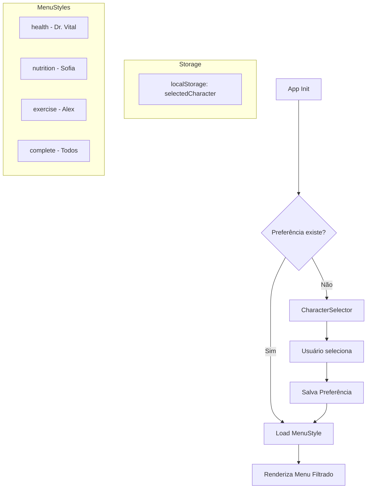

# Design Document: Character Menu Selector

## Overview

O Character Menu Selector é uma feature que apresenta uma tela de seleção de personagens na abertura do app. Cada personagem representa um "estilo de experiência" diferente, filtrando as funcionalidades visíveis no menu principal. Isso permite que usuários com interesses específicos (saúde, nutrição ou exercícios) tenham uma experiência mais focada e menos sobrecarregada.

## Architecture



### Fluxo de Dados

1. **Inicialização**: App verifica `localStorage.getItem('selectedCharacter')`
2. **Primeira vez**: Exibe `CharacterSelector` em tela cheia
3. **Seleção**: Usuário clica em personagem → salva preferência → redireciona
4. **Retorno**: App carrega diretamente o menu filtrado baseado na preferência

## Components and Interfaces

### CharacterSelector Component

```typescript
interface Character {
  id: 'health' | 'nutrition' | 'exercise' | 'complete';
  name: string;
  description: string;
  imagePath: string;
  features: string[];
}

interface CharacterSelectorProps {
  onSelect: (characterId: Character['id']) => void;
  isChanging?: boolean; // true quando vem das configurações
}

const characters: Character[] = [
  {
    id: 'health',
    name: 'Dr. Vital',
    description: 'Foco em saúde e exames',
    imagePath: '/images/dr-vital-full.png',
    features: ['health-timeline', 'exam-analysis', 'health-metrics', 'predictions']
  },
  {
    id: 'nutrition',
    name: 'Sofia',
    description: 'Foco em nutrição e alimentação',
    imagePath: '/images/sofia-full.png',
    features: ['food-analysis', 'meal-plan', 'sofia-chat', 'supplements']
  },
  {
    id: 'exercise',
    name: 'Alex',
    description: 'Foco em exercícios e treinos',
    imagePath: '/images/alex-full.png',
    features: ['workouts', 'rest-timer', 'progression', 'camera-workout']
  },
  {
    id: 'complete',
    name: 'Experiência Completa',
    description: 'Todas as funcionalidades',
    imagePath: '/images/3-personagem.png',
    features: ['all']
  }
];
```

### useMenuStyle Hook

```typescript
interface UseMenuStyleReturn {
  selectedCharacter: Character['id'] | null;
  isFeatureVisible: (featureId: string) => boolean;
  setCharacter: (id: Character['id']) => void;
  clearPreference: () => void;
  isLoading: boolean;
}

function useMenuStyle(): UseMenuStyleReturn {
  // Lê do localStorage
  // Retorna funções para verificar visibilidade de features
}
```

### MenuStyleContext

```typescript
interface MenuStyleContextValue {
  characterId: Character['id'] | null;
  visibleFeatures: string[];
  isFeatureVisible: (featureId: string) => boolean;
}
```

## Data Models

### Feature Registry

```typescript
// Mapeamento de features por categoria
const featureRegistry = {
  health: [
    'health-timeline',
    'exam-analysis', 
    'health-metrics',
    'health-predictions',
    'dr-vital-chat',
    'health-score'
  ],
  nutrition: [
    'food-analysis',
    'meal-plan',
    'sofia-chat',
    'supplements',
    'nutrition-tracking',
    'calorie-counter'
  ],
  exercise: [
    'workouts',
    'rest-timer',
    'progression',
    'camera-workout',
    'exercise-gamification',
    'social-hub'
  ],
  shared: [
    'dashboard',
    'profile',
    'settings',
    'goals',
    'community',
    'challenges'
  ]
};

// Função para obter features visíveis
function getVisibleFeatures(characterId: Character['id']): string[] {
  if (characterId === 'complete') {
    return [...featureRegistry.health, ...featureRegistry.nutrition, 
            ...featureRegistry.exercise, ...featureRegistry.shared];
  }
  return [...featureRegistry[characterId], ...featureRegistry.shared];
}
```

### LocalStorage Schema

```typescript
// Key: 'maxnutrition_selected_character'
// Value: 'health' | 'nutrition' | 'exercise' | 'complete'

const STORAGE_KEY = 'maxnutrition_selected_character';

function savePreference(characterId: Character['id']): void {
  localStorage.setItem(STORAGE_KEY, characterId);
}

function loadPreference(): Character['id'] | null {
  const saved = localStorage.getItem(STORAGE_KEY);
  if (saved && ['health', 'nutrition', 'exercise', 'complete'].includes(saved)) {
    return saved as Character['id'];
  }
  return null;
}
```

## Correctness Properties

*A property is a characteristic or behavior that should hold true across all valid executions of a system-essentially, a formal statement about what the system should do. Properties serve as the bridge between human-readable specifications and machine-verifiable correctness guarantees.*

### Property 1: Preference Round-Trip Consistency

*For any* valid character ID, saving the preference and then loading it should return the same character ID.

**Validates: Requirements 6.1, 6.2, 6.3**

### Property 2: Feature Visibility by Style

*For any* character style (health, nutrition, exercise), only features belonging to that style plus shared features should be visible.

**Validates: Requirements 2.1, 2.3, 3.1, 3.3, 4.1, 4.3**

### Property 3: Complete Style Contains All Features

*For any* feature in the system, if the character style is "complete", that feature should be visible.

**Validates: Requirements 5.1, 5.2**

### Property 4: Character Selection Updates Preference

*For any* character selection action, the stored preference should match the selected character ID after the action completes.

**Validates: Requirements 7.2, 7.3**

### Property 5: Selector Display Logic

*For any* app initialization, the CharacterSelector should be displayed if and only if no valid preference exists in storage.

**Validates: Requirements 1.1, 1.2**

### Property 6: Character Data Completeness

*For any* character in the characters array, it should have a non-empty name, description, imagePath, and at least one feature.

**Validates: Requirements 1.4**

## Error Handling

### Invalid Preference

```typescript
function loadPreference(): Character['id'] | null {
  try {
    const saved = localStorage.getItem(STORAGE_KEY);
    if (!saved) return null;
    
    const validIds = ['health', 'nutrition', 'exercise', 'complete'];
    if (!validIds.includes(saved)) {
      // Preferência inválida - limpar e retornar null
      localStorage.removeItem(STORAGE_KEY);
      return null;
    }
    
    return saved as Character['id'];
  } catch (error) {
    // localStorage indisponível (modo privado, etc)
    console.warn('Could not access localStorage:', error);
    return null;
  }
}
```

### Image Loading Fallback

```typescript
// Se imagem não carregar, mostrar placeholder com inicial do personagem
 {
    e.currentTarget.src = '/placeholder.svg';
  }}
/>
```

## Testing Strategy

### Unit Tests

- Testar `loadPreference()` com valores válidos, inválidos e null
- Testar `savePreference()` e verificar localStorage
- Testar `getVisibleFeatures()` para cada estilo
- Testar `isFeatureVisible()` com diferentes combinações

### Property-Based Tests

Usar `fast-check` para testes de propriedade:

1. **Round-trip de preferência**: Gerar IDs aleatórios válidos, salvar, carregar, comparar
2. **Visibilidade de features**: Gerar estilos aleatórios, verificar que features corretas estão visíveis
3. **Completude do estilo completo**: Verificar que "complete" contém todas as features de todos os estilos

### Integration Tests

- Testar fluxo completo: abrir app → selecionar personagem → verificar menu filtrado
- Testar troca de personagem via configurações
- Testar persistência após reload da página

### Configuration

- Mínimo 100 iterações por teste de propriedade
- Tag format: **Feature: character-menu-selector, Property {number}: {property_text}**
