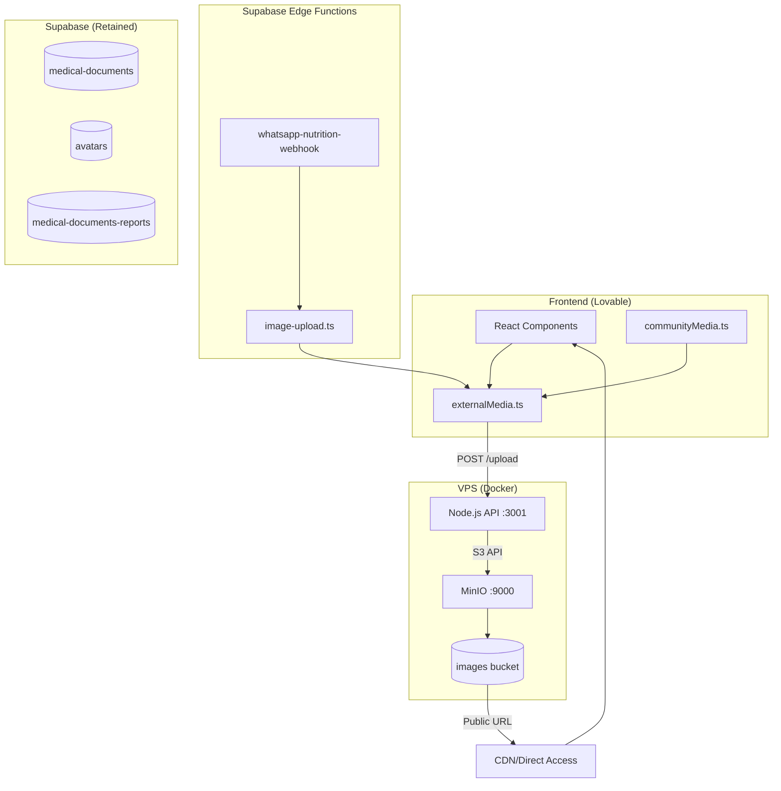

# Design Document: Media Storage Migration

## Overview

This design describes the architecture for migrating media storage from Supabase Storage to a self-hosted MinIO instance on a VPS. The solution introduces a Node.js 20 Alpine API service that handles file uploads and returns public MinIO URLs. The frontend and Edge Functions will use a new `externalMedia.ts` library to interact with this API, while sensitive data (medical documents, avatars) remains in Supabase Storage.

### Key Design Decisions

1. **MinIO as S3-compatible storage**: Provides familiar API, easy migration path, and cost savings
2. **Node.js 20 Alpine API**: Lightweight, fast, handles multipart uploads and base64 conversion
3. **Single bucket with folder structure**: `images/` bucket with subfolders (whatsapp, feed, stories, profiles)
4. **Public read access**: Media URLs are publicly accessible without authentication
5. **Graceful degradation**: If VPS is unavailable, operations fail gracefully with user-friendly errors

## Architecture



### Folder Structure in MinIO

```
images/
├── whatsapp/
│   └── {userId}/
│       └── {timestamp}-{uuid}.{ext}
├── feed/
│   └── {userId}/
│       └── {timestamp}-{uuid}.{ext}
├── stories/
│   └── {userId}/
│       └── {timestamp}-{uuid}.{ext}
└── profiles/
    └── {userId}/
        └── {timestamp}-{uuid}.{ext}
```

## Components and Interfaces

### 1. External Storage Client (`src/lib/externalMedia.ts`)

```typescript
// Types
export type MediaFolder = 'whatsapp' | 'feed' | 'stories' | 'profiles';

export interface UploadOptions {
  folder: MediaFolder;
  userId: string;
  filename?: string;
  maxSizeMB?: number;
}

export interface UploadResult {
  success: true;
  url: string;
  path: string;
  size: number;
  mimeType: string;
}

export interface UploadError {
  success: false;
  error: string;
  code?: string;
}

export type UploadResponse = UploadResult | UploadError;

// Main function signature
export async function uploadToExternalStorage(
  file: File | Blob | string, // File, Blob, or base64 string
  options: UploadOptions
): Promise<UploadResponse>;

// Validation function
export function validateMediaFile(
  file: File | Blob,
  maxSizeMB?: number
): { valid: boolean; error?: string };
```

### 2. Media API (Node.js on VPS)

**Endpoint**: `POST /upload`

**Request (JSON)**:
```typescript
interface UploadRequest {
  file: string;      // base64 encoded file data
  folder: string;    // 'whatsapp' | 'feed' | 'stories' | 'profiles'
  userId: string;    // user identifier for path organization
  filename?: string; // optional custom filename
}
```

**Request (Multipart)**:
```
Content-Type: multipart/form-data
- file: binary data
- folder: string
- userId: string
- filename?: string
```

**Response (Success)**:
```typescript
interface UploadSuccessResponse {
  success: true;
  url: string;      // Public MinIO URL
  path: string;     // Full path in bucket
  size: number;     // File size in bytes
  mimeType: string; // Detected MIME type
}
```

**Response (Error)**:
```typescript
interface UploadErrorResponse {
  success: false;
  error: string;
  code?: string; // 'INVALID_TYPE' | 'FILE_TOO_LARGE' | 'UPLOAD_FAILED'
}
```

### 3. Updated Community Media (`src/lib/communityMedia.ts`)

The existing `communityMedia.ts` will be updated to use `externalMedia.ts`:

```typescript
import { uploadToExternalStorage, validateMediaFile } from '@/lib/externalMedia';

export async function uploadCommunityMedia(
  file: File,
  folder: 'stories' | 'posts',
  userId: string
): Promise<UploadResult> {
  // Map 'posts' to 'feed' for external storage
  const externalFolder = folder === 'posts' ? 'feed' : folder;
  
  const response = await uploadToExternalStorage(file, {
    folder: externalFolder,
    userId,
  });
  
  if (!response.success) {
    throw new Error(response.error);
  }
  
  return {
    publicUrl: response.url,
    path: response.path,
    mimeType: response.mimeType,
  };
}
```

### 4. Updated WhatsApp Image Handler

The Edge Function `image-upload.ts` will be updated:

```typescript
// New function to upload to external storage
export async function uploadToExternalMedia(
  userId: string,
  bytes: Uint8Array,
  contentType: string
): Promise<string | null> {
  const MEDIA_API_URL = Deno.env.get('MEDIA_API_URL');
  const MEDIA_API_KEY = Deno.env.get('MEDIA_API_KEY');
  
  if (!MEDIA_API_URL) {
    console.error('[ImageUpload] MEDIA_API_URL não configurado');
    return null;
  }
  
  // Convert bytes to base64
  const base64 = btoa(String.fromCharCode(...bytes));
  
  const response = await fetch(`${MEDIA_API_URL}/upload`, {
    method: 'POST',
    headers: {
      'Content-Type': 'application/json',
      ...(MEDIA_API_KEY && { 'Authorization': `Bearer ${MEDIA_API_KEY}` }),
    },
    body: JSON.stringify({
      file: base64,
      folder: 'whatsapp',
      userId,
      mimeType: contentType,
    }),
  });
  
  if (!response.ok) {
    console.error('[ImageUpload] Erro no upload externo:', response.status);
    return null;
  }
  
  const result = await response.json();
  return result.success ? result.url : null;
}
```

## Data Models

### Environment Variables

**Frontend (.env)**:
```bash
VITE_MEDIA_API_URL=https://media.yourdomain.com
```

**Edge Functions (Supabase Secrets)**:
```bash
MEDIA_API_URL=https://media.yourdomain.com
MEDIA_API_KEY=optional-secret-key
```

**VPS (docker-compose.yml)**:
```yaml
services:
  media-api:
    image: node:20-alpine
    environment:
      - MINIO_ENDPOINT=minio
      - MINIO_PORT=9000
      - MINIO_ACCESS_KEY=${MINIO_ACCESS_KEY}
      - MINIO_SECRET_KEY=${MINIO_SECRET_KEY}
      - MINIO_BUCKET=images
      - API_KEY=${MEDIA_API_KEY}
    ports:
      - "3001:3001"
      
  minio:
    image: minio/minio
    command: server /data --console-address ":9001"
    environment:
      - MINIO_ROOT_USER=${MINIO_ACCESS_KEY}
      - MINIO_ROOT_PASSWORD=${MINIO_SECRET_KEY}
    volumes:
      - minio_data:/data
    ports:
      - "9000:9000"
      - "9001:9001"
```

### Allowed MIME Types

```typescript
const ALLOWED_MIME_TYPES = [
  'image/jpeg',
  'image/png',
  'image/gif',
  'image/webp',
  'video/mp4',
  'video/quicktime',
  'video/webm',
];
```


## Correctness Properties

*A property is a characteristic or behavior that should hold true across all valid executions of a system—essentially, a formal statement about what the system should do. Properties serve as the bridge between human-readable specifications and machine-verifiable correctness guarantees.*

### Property 1: Upload Result Structure Completeness

*For any* valid file upload that succeeds, the returned Upload_Result SHALL contain all required fields: `url` (non-empty string), `path` (non-empty string), `size` (positive number), and `mimeType` (valid MIME type string).

**Validates: Requirements 1.2, 2.4**

### Property 2: Input Format Flexibility

*For any* valid file content, uploading it as a base64-encoded string SHALL produce the same result (same file stored, same size, same MIME type) as uploading it as a File/Blob object.

**Validates: Requirements 1.4**

### Property 3: MIME Type Validation Consistency

*For any* file with a MIME type, the validation function SHALL return `valid: true` if and only if the MIME type is in the allowed list (image/jpeg, image/png, image/gif, image/webp, video/mp4, video/quicktime, video/webm). For invalid types, the error message SHALL be "Formato não suportado. Use JPEG, PNG, GIF, WebP, MP4, MOV ou WebM."

**Validates: Requirements 1.5, 7.1, 7.3**

### Property 4: File Size Validation Consistency

*For any* file and configured maximum size, the validation function SHALL return `valid: true` if and only if the file size is less than or equal to the maximum. For oversized files, the error message SHALL match the pattern "Arquivo muito grande. Máximo {maxSize}MB."

**Validates: Requirements 1.6, 7.2, 7.4**

### Property 5: No Network Request on Validation Failure

*For any* file that fails client-side validation (invalid type or size), the upload function SHALL NOT make any network request to the Media_API.

**Validates: Requirements 1.7**

### Property 6: Unique Filename Generation

*For any* two uploads without explicit filenames, the generated filenames SHALL be unique (no collisions). This holds even for uploads of identical file content.

**Validates: Requirements 2.6**

### Property 7: Path Structure Pattern

*For any* successful upload with folder `F` and userId `U`, the returned path SHALL match the pattern `{U}/{F}/{timestamp}-{uuid}.{extension}` where the extension corresponds to the file's MIME type.

**Validates: Requirements 2.7, 4.2, 4.4**

### Property 8: Server-Client Validation Consistency

*For any* file, the server-side validation result SHALL match the client-side validation result. If the client accepts a file, the server SHALL accept it; if the client rejects it, the server SHALL reject it with the same error category.

**Validates: Requirements 7.5**

### Property 9: Public URL Accessibility

*For any* URL returned by a successful upload, an unauthenticated HTTP GET request to that URL SHALL return the original file content with status 200.

**Validates: Requirements 8.1, 8.3**

## Error Handling

### Client-Side Errors (External Storage Client)

| Error Condition | Error Code | User Message |
|-----------------|------------|--------------|
| Invalid MIME type | `INVALID_TYPE` | "Formato não suportado. Use JPEG, PNG, GIF, WebP, MP4, MOV ou WebM." |
| File too large | `FILE_TOO_LARGE` | "Arquivo muito grande. Máximo {maxSize}MB." |
| Missing MEDIA_API_URL | `CONFIG_ERROR` | "Configuração de upload não encontrada." |
| Network error | `NETWORK_ERROR` | "Erro de conexão. Tente novamente." |
| API error (4xx/5xx) | `UPLOAD_FAILED` | "Erro ao fazer upload. Tente novamente." |

### Server-Side Errors (Media API)

| HTTP Status | Error Code | Description |
|-------------|------------|-------------|
| 400 | `INVALID_REQUEST` | Missing required fields or invalid format |
| 400 | `INVALID_TYPE` | MIME type not allowed |
| 400 | `FILE_TOO_LARGE` | File exceeds size limit |
| 401 | `UNAUTHORIZED` | Invalid or missing API key |
| 500 | `STORAGE_ERROR` | MinIO upload failed |
| 503 | `SERVICE_UNAVAILABLE` | MinIO not reachable |

### Edge Function Error Handling

```typescript
try {
  const url = await uploadToExternalMedia(userId, bytes, contentType);
  if (url) {
    // Store URL in database
  } else {
    // Continue without image, log warning
    console.warn('[ImageUpload] Upload externo falhou, continuando sem imagem');
  }
} catch (error) {
  // Log error, continue processing message
  console.error('[ImageUpload] Erro crítico:', error);
}
```

## Testing Strategy

### Unit Tests

Unit tests will cover specific examples and edge cases:

1. **Validation edge cases**: Empty files, exactly max size, boundary MIME types
2. **Error message formatting**: Verify exact error messages match requirements
3. **Configuration errors**: Missing env vars, invalid URLs
4. **Base64 encoding/decoding**: Special characters, padding

### Property-Based Tests

Property tests will use a property-based testing library (e.g., fast-check for TypeScript) to verify universal properties:

1. **MIME type validation**: Generate random MIME types, verify correct acceptance/rejection
2. **File size validation**: Generate files of various sizes, verify size limit enforcement
3. **Filename uniqueness**: Generate many uploads, verify no collisions
4. **Path structure**: Generate uploads with various folders/userIds, verify path pattern
5. **Round-trip**: Upload file, download from URL, verify content matches

**Configuration**:
- Minimum 100 iterations per property test
- Each test tagged with: **Feature: media-storage-migration, Property {N}: {description}**

### Integration Tests

1. **End-to-end upload flow**: Upload via client → API → MinIO → verify URL works
2. **Community media integration**: Verify feed/stories use external storage
3. **WhatsApp integration**: Verify webhook uploads to external storage
4. **Retained buckets**: Verify medical-documents still uses Supabase

### Test Environment

```yaml
# docker-compose.test.yml
services:
  minio-test:
    image: minio/minio
    command: server /data
    environment:
      - MINIO_ROOT_USER=testuser
      - MINIO_ROOT_PASSWORD=testpassword
    ports:
      - "9100:9000"
```
