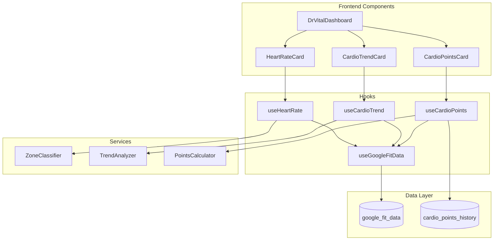

# Design Document: Real Heart Monitoring System

## Overview

Este documento descreve o design técnico do sistema de Monitoramento Cardíaco Real para o dashboard de saúde. O sistema substitui os cards de Pressão e Glicose (não suportados pelo Google Fit) por métricas cardiovasculares reais e gamificadas, incluindo batimento cardíaco em tempo real, tendência cardiovascular e pontos cardio.

## Architecture



## Components and Interfaces

### HeartRateCard Component

```typescript
interface HeartRateCardProps {
  className?: string;
}

interface HeartRateData {
  currentBpm: number | null;
  zone: 'bradycardia' | 'normal' | 'elevated' | 'unknown';
  lastUpdated: Date | null;
  isConnected: boolean;
}
```

O componente exibe:
- BPM atual com animação de pulso
- Indicador de zona colorido (azul/verde/laranja)
- Timestamp da última leitura
- Estado de conexão com Google Fit

### CardioTrendCard Component

```typescript
interface CardioTrendCardProps {
  className?: string;
}

interface TrendData {
  trend: 'improving' | 'stable' | 'declining' | 'insufficient';
  weeklyAverages: number[]; // últimos 7 dias
  changePercent: number;
  message: string;
}
```

O componente exibe:
- Seta de tendência com cor
- Mini sparkline dos últimos 7 dias
- Mensagem descritiva
- Percentual de mudança

### CardioPointsCard Component

```typescript
interface CardioPointsCardProps {
  className?: string;
  dailyGoal?: number; // default: 150 pontos
}

interface CardioPointsData {
  todayPoints: number;
  yesterdayPoints: number;
  dailyGoal: number;
  progressPercent: number;
  zoneBreakdown: {
    fatBurn: number;
    cardio: number;
    peak: number;
  };
}
```

O componente exibe:
- Pontos do dia com progress ring
- Comparação com dia anterior
- Breakdown por zona (opcional)
- Animação de celebração ao atingir meta

## Data Models

### Heart Rate Zone Classification

```typescript
type HeartRateZone = 'bradycardia' | 'normal' | 'elevated';

function classifyHeartRateZone(bpm: number): HeartRateZone {
  if (bpm < 60) return 'bradycardia';
  if (bpm <= 100) return 'normal';
  return 'elevated';
}

const ZONE_COLORS = {
  bradycardia: 'text-blue-500',
  normal: 'text-emerald-500',
  elevated: 'text-orange-500',
  unknown: 'text-muted-foreground'
};
```

### Cardio Points Calculation

```typescript
interface CardioZone {
  name: 'rest' | 'fatBurn' | 'cardio' | 'peak';
  minPercent: number;
  maxPercent: number;
  pointsPerMinute: number;
}

const CARDIO_ZONES: CardioZone[] = [
  { name: 'rest', minPercent: 0, maxPercent: 50, pointsPerMinute: 0 },
  { name: 'fatBurn', minPercent: 50, maxPercent: 70, pointsPerMinute: 1 },
  { name: 'cardio', minPercent: 70, maxPercent: 85, pointsPerMinute: 2 },
  { name: 'peak', minPercent: 85, maxPercent: 100, pointsPerMinute: 3 }
];

function calculateMaxHeartRate(age: number): number {
  return 220 - age;
}

function getCardioZone(bpm: number, maxHR: number): CardioZone {
  const percent = (bpm / maxHR) * 100;
  return CARDIO_ZONES.find(z => percent >= z.minPercent && percent < z.maxPercent) 
    || CARDIO_ZONES[0];
}

function calculateDailyPoints(
  heartRateSamples: { bpm: number; durationMinutes: number }[],
  userAge: number
): number {
  const maxHR = calculateMaxHeartRate(userAge);
  return heartRateSamples.reduce((total, sample) => {
    const zone = getCardioZone(sample.bpm, maxHR);
    return total + (zone.pointsPerMinute * sample.durationMinutes);
  }, 0);
}
```

### Trend Analysis

```typescript
type TrendDirection = 'improving' | 'stable' | 'declining' | 'insufficient';

interface TrendResult {
  direction: TrendDirection;
  changePercent: number;
  message: string;
}

function analyzeTrend(dailyAverages: number[]): TrendResult {
  if (dailyAverages.length < 3) {
    return {
      direction: 'insufficient',
      changePercent: 0,
      message: 'Dados insuficientes - sincronize mais dias'
    };
  }
  
  const recent = dailyAverages.slice(-3).reduce((a, b) => a + b, 0) / 3;
  const older = dailyAverages.slice(0, 3).reduce((a, b) => a + b, 0) / 3;
  const change = recent - older;
  const changePercent = (change / older) * 100;
  
  // Para frequência cardíaca, diminuir é bom (melhor condicionamento)
  if (change < -5) {
    return {
      direction: 'improving',
      changePercent,
      message: 'Sua saúde cardíaca está melhorando!'
    };
  }
  if (change > 5) {
    return {
      direction: 'declining',
      changePercent,
      message: 'Atenção: frequência cardíaca aumentando'
    };
  }
  return {
    direction: 'stable',
    changePercent,
    message: 'Frequência cardíaca estável'
  };
}
```

### Database Schema Extension

```sql
-- Tabela para histórico de pontos cardio
CREATE TABLE IF NOT EXISTS cardio_points_history (
  id UUID PRIMARY KEY DEFAULT gen_random_uuid(),
  user_id UUID NOT NULL REFERENCES auth.users(id) ON DELETE CASCADE,
  date DATE NOT NULL,
  total_points INTEGER NOT NULL DEFAULT 0,
  fat_burn_minutes INTEGER DEFAULT 0,
  cardio_minutes INTEGER DEFAULT 0,
  peak_minutes INTEGER DEFAULT 0,
  created_at TIMESTAMPTZ DEFAULT NOW(),
  updated_at TIMESTAMPTZ DEFAULT NOW(),
  UNIQUE(user_id, date)
);

-- Index para queries por usuário e data
CREATE INDEX idx_cardio_points_user_date ON cardio_points_history(user_id, date DESC);

-- RLS policies
ALTER TABLE cardio_points_history ENABLE ROW LEVEL SECURITY;

CREATE POLICY "Users can view own cardio points"
  ON cardio_points_history FOR SELECT
  USING (auth.uid() = user_id);

CREATE POLICY "Users can insert own cardio points"
  ON cardio_points_history FOR INSERT
  WITH CHECK (auth.uid() = user_id);

CREATE POLICY "Users can update own cardio points"
  ON cardio_points_history FOR UPDATE
  USING (auth.uid() = user_id);
```

## Correctness Properties

*A property is a characteristic or behavior that should hold true across all valid executions of a system—essentially, a formal statement about what the system should do. Properties serve as the bridge between human-readable specifications and machine-verifiable correctness guarantees.*

### Property 1: Heart Rate Zone Classification

*For any* heart rate value (bpm), the zone classifier SHALL return exactly one of the three zones: 'bradycardia' for bpm < 60, 'normal' for 60 ≤ bpm ≤ 100, and 'elevated' for bpm > 100.

**Validates: Requirements 1.4, 1.5, 1.6**

### Property 2: Most Recent Heart Rate Selection

*For any* non-empty array of heart rate readings with timestamps, the display function SHALL return the reading with the most recent timestamp.

**Validates: Requirements 1.1, 1.7**

### Property 3: Trend Classification Consistency

*For any* array of 7 daily heart rate averages, if the difference between the average of the last 3 days and the first 3 days is less than -5 bpm, the trend SHALL be 'improving'; if greater than +5 bpm, the trend SHALL be 'declining'; otherwise 'stable'.

**Validates: Requirements 2.2, 2.3, 2.4**

### Property 4: Cardio Points Zone Calculation

*For any* heart rate sample with duration, the points awarded SHALL equal: duration_minutes × zone_multiplier, where zone_multiplier is 1 for fat-burn (50-70% max HR), 2 for cardio (70-85% max HR), and 3 for peak (85-100% max HR).

**Validates: Requirements 3.1, 3.2, 3.3**

### Property 5: Max Heart Rate Formula

*For any* user age between 1 and 120, the calculated max heart rate SHALL equal 220 - age.

**Validates: Requirements 3.4**

### Property 6: Progress Percentage Calculation

*For any* daily points value and goal, the progress percentage SHALL equal min(100, (points / goal) × 100), ensuring it never exceeds 100%.

**Validates: Requirements 3.5**

### Property 7: Day Comparison Calculation

*For any* two consecutive days of cardio points, the comparison value SHALL equal today_points - yesterday_points, with appropriate sign.

**Validates: Requirements 3.8**

### Property 8: Sync Timing Logic

*For any* last sync timestamp, the sync SHALL trigger if and only if the current time minus last sync time is greater than 15 minutes.

**Validates: Requirements 5.1**

### Property 9: Token Expiry Detection

*For any* token with expiry timestamp, the token SHALL be considered expired if and only if the current time is greater than the expiry timestamp.

**Validates: Requirements 5.3**

### Property 10: Cardio Points Persistence Round-Trip

*For any* valid cardio points record, saving to the database and then retrieving by user_id and date SHALL return an equivalent record.

**Validates: Requirements 3.7**

### Property 11: Sparkline Data Transformation

*For any* array of daily heart rate averages, the sparkline data transformation SHALL produce an array of the same length with values normalized to the display range.

**Validates: Requirements 2.5**

## Error Handling

### Google Fit Connection Errors

```typescript
interface ConnectionError {
  type: 'not_connected' | 'token_expired' | 'sync_failed' | 'no_data';
  message: string;
  action: 'connect' | 'reconnect' | 'retry' | 'wait';
}

const ERROR_MESSAGES: Record<ConnectionError['type'], ConnectionError> = {
  not_connected: {
    type: 'not_connected',
    message: 'Conecte o Google Fit para ver seus dados cardíacos',
    action: 'connect'
  },
  token_expired: {
    type: 'token_expired',
    message: 'Sessão expirada. Reconecte o Google Fit',
    action: 'reconnect'
  },
  sync_failed: {
    type: 'sync_failed',
    message: 'Erro ao sincronizar. Tente novamente',
    action: 'retry'
  },
  no_data: {
    type: 'no_data',
    message: 'Nenhum dado cardíaco encontrado. Use seu smartwatch',
    action: 'wait'
  }
};
```

### Fallback States

- Sem dados: Exibir "--" com mensagem de conexão
- Dados antigos (>24h): Exibir com aviso "Dados de X horas atrás"
- Erro de sync: Exibir último dado válido com indicador de erro

## Testing Strategy

### Unit Tests

- Testar classificação de zonas com valores limítrofes (59, 60, 100, 101)
- Testar cálculo de pontos com diferentes durações e zonas
- Testar análise de tendência com arrays de diferentes tamanhos
- Testar formatação de timestamps

### Property-Based Tests

Usar fast-check para TypeScript:

```typescript
import * as fc from 'fast-check';

// Property 1: Zone classification
fc.assert(
  fc.property(fc.integer({ min: 30, max: 200 }), (bpm) => {
    const zone = classifyHeartRateZone(bpm);
    if (bpm < 60) return zone === 'bradycardia';
    if (bpm <= 100) return zone === 'normal';
    return zone === 'elevated';
  })
);

// Property 4: Points calculation
fc.assert(
  fc.property(
    fc.integer({ min: 1, max: 180 }), // duration
    fc.integer({ min: 50, max: 200 }), // bpm
    fc.integer({ min: 18, max: 80 }), // age
    (duration, bpm, age) => {
      const maxHR = 220 - age;
      const percent = (bpm / maxHR) * 100;
      const points = calculatePointsForSample(bpm, duration, age);
      
      if (percent < 50) return points === 0;
      if (percent < 70) return points === duration * 1;
      if (percent < 85) return points === duration * 2;
      return points === duration * 3;
    }
  )
);
```

### Integration Tests

- Testar fluxo completo de sync → cálculo → exibição
- Testar persistência de pontos no banco
- Testar atualização em tempo real dos componentes

### Test Configuration

- Mínimo 100 iterações por property test
- Usar seeds fixas para reprodutibilidade
- Cada teste deve referenciar a propriedade do design
