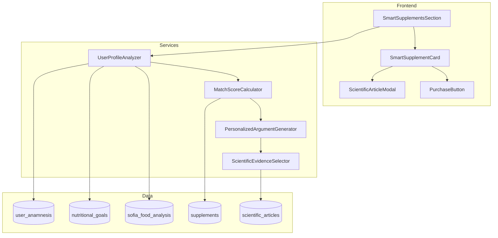

# Design Document: Smart Supplement Recommendations

## Overview

Sistema de recomendação inteligente de suplementos que utiliza IA para analisar o perfil completo do usuário e gerar recomendações personalizadas com argumentação científica. O sistema atua como um "vendedor invisível" que convence o usuário através de dados personalizados e evidências científicas.

### Fluxo Principal

```
┌─────────────────┐     ┌──────────────────┐     ┌─────────────────┐
│  Dados Usuário  │────▶│  Motor de Match  │────▶│  Recomendações  │
│  (Anamnese,     │     │  Score + IA      │     │  Personalizadas │
│   Objetivos,    │     │                  │     │                 │
│   Alimentação)  │     └──────────────────┘     └─────────────────┘
└─────────────────┘              │                        │
                                 ▼                        ▼
                    ┌──────────────────┐     ┌─────────────────┐
                    │  Base Científica │     │  Card Premium   │
                    │  (Artigos)       │     │  com Argumentos │
                    └──────────────────┘     └─────────────────┘
```

## Architecture

### Componentes Principais

1. **UserProfileAnalyzer** - Coleta e analisa todos os dados do usuário
2. **MatchScoreCalculator** - Calcula compatibilidade produto-usuário
3. **PersonalizedArgumentGenerator** - Gera textos persuasivos personalizados
4. **ScientificEvidenceSelector** - Seleciona artigos científicos relevantes
5. **SmartSupplementCard** - Componente visual premium do produto

### Diagrama de Arquitetura



## Components and Interfaces

### 1. UserProfileAnalyzer

```typescript
interface UserHealthProfile {
  // Dados básicos
  userId: string;
  age: number;
  gender: 'masculino' | 'feminino';
  weight: number;
  height: number;
  bmi: number;
  
  // Objetivo principal
  primaryGoal: 'lose_weight' | 'gain_mass' | 'maintain' | 'health';
  
  // Problemas de saúde (da anamnese)
  healthIssues: {
    sleep: { hasIssue: boolean; severity: number; details?: string };
    stress: { hasIssue: boolean; severity: number; details?: string };
    energy: { hasIssue: boolean; severity: number; details?: string };
    digestion: { hasIssue: boolean; severity: number; details?: string };
    immunity: { hasIssue: boolean; severity: number; details?: string };
    focus: { hasIssue: boolean; severity: number; details?: string };
    pain: { hasIssue: boolean; severity: number; location?: string };
  };
  
  // Deficiências nutricionais detectadas
  nutritionalDeficiencies: string[];
  
  // Condições crônicas
  chronicConditions: string[];
  
  // Medicamentos em uso
  currentMedications: string[];
  
  // Alergias
  allergies: string[];
}

interface UserProfileAnalyzerService {
  analyzeProfile(userId: string): Promise<UserHealthProfile>;
  extractHealthIssues(anamnesis: any): UserHealthProfile['healthIssues'];
  detectNutritionalDeficiencies(foodHistory: any[]): string[];
}
```

### 2. MatchScoreCalculator

```typescript
interface MatchScoreResult {
  totalScore: number; // 0-100
  breakdown: {
    goalAlignment: number;      // 40% weight
    problemResolution: number;  // 30% weight
    deficiencyFill: number;     // 20% weight
    purchaseHistory: number;    // 10% weight
  };
  badge: 'ideal' | 'recommended' | 'may_help';
  badgeLabel: string;
  badgeColor: string;
}

interface MatchScoreCalculatorService {
  calculateScore(
    product: Supplement,
    userProfile: UserHealthProfile
  ): MatchScoreResult;
  
  getBadgeForScore(score: number): {
    type: 'ideal' | 'recommended' | 'may_help';
    label: string;
    color: string;
  };
}
```

### 3. PersonalizedArgumentGenerator

```typescript
interface PersonalizedArgument {
  mainText: string;           // Texto principal personalizado
  userDataMentioned: string[]; // Dados do usuário mencionados
  benefitsHighlighted: string[]; // Benefícios destacados
  emotionalTone: 'empathetic' | 'motivational' | 'informative';
}

interface ArgumentGeneratorService {
  generateArgument(
    product: Supplement,
    userProfile: UserHealthProfile,
    matchScore: MatchScoreResult
  ): PersonalizedArgument;
  
  selectRelevantProblems(
    userProfile: UserHealthProfile,
    productBenefits: string[]
  ): string[];
}
```

### 4. ScientificEvidenceSelector

```typescript
interface ScientificArticle {
  id: string;
  title: string;
  titlePt: string;           // Título em português
  url: string;               // Link para PubMed/fonte
  source: 'pubmed' | 'scielo' | 'other';
  summaryPt: string;         // Resumo em português
  relatedIngredient: string; // Ativo relacionado
  relevanceScore: number;    // Score de relevância para o usuário
  publishedYear: number;
}

interface EvidenceSelectorService {
  selectBestArticle(
    product: Supplement,
    userProfile: UserHealthProfile
  ): ScientificArticle;
  
  rankArticlesByRelevance(
    articles: ScientificArticle[],
    userProblems: string[]
  ): ScientificArticle[];
}
```

### 5. SmartSupplementCard (Component)

```typescript
interface SmartSupplementCardProps {
  product: Supplement;
  matchScore: MatchScoreResult;
  personalizedArgument: PersonalizedArgument;
  scientificArticle: ScientificArticle;
  onPurchase: () => void;
  onArticleClick: () => void;
  onView: () => void; // Para tracking
}
```

## Data Models

### Supplement (Enhanced)

```typescript
interface Supplement {
  id: string;
  name: string;
  externalId: string;
  category: string;
  categories: string[];        // Múltiplas categorias
  brand: string;
  imageUrl: string;
  originalPrice: number;
  discountPrice?: number;
  description: string;
  
  // Ativos e benefícios
  activeIngredients: ActiveIngredient[];
  benefits: string[];
  benefitTags: string[];       // Tags curtas para UI
  
  // Mapeamento para condições
  targetConditions: string[];  // Ex: ['sono', 'estresse', 'energia']
  targetGoals: string[];       // Ex: ['lose_weight', 'gain_mass']
  
  // Artigos científicos
  scientificArticles: ScientificArticle[];
  
  // Dosagem
  recommendedDosage: string;
  
  // Status
  isAvailable: boolean;
  stockQuantity: number;
}

interface ActiveIngredient {
  name: string;
  amount: string;
  unit: string;
  benefits: string[];
  scientificEvidence: string; // Link para estudo
}
```

### Mapeamento Ativo → Condição

```typescript
const INGREDIENT_CONDITION_MAP: Record<string, string[]> = {
  'melatonina': ['sono', 'insonia', 'jet_lag'],
  'ashwagandha': ['estresse', 'ansiedade', 'cortisol'],
  'vitamina_d': ['imunidade', 'ossos', 'humor'],
  'omega_3': ['cardiovascular', 'cerebro', 'inflamacao'],
  'colageno': ['pele', 'articulacoes', 'cabelo'],
  'creatina': ['musculos', 'energia', 'performance'],
  'cafeina': ['energia', 'foco', 'termogenico'],
  'probioticos': ['digestao', 'imunidade', 'intestino'],
  'magnesio': ['sono', 'musculos', 'estresse'],
  'zinco': ['imunidade', 'testosterona', 'pele'],
  'vitamina_c': ['imunidade', 'antioxidante', 'colageno'],
  'curcuma': ['inflamacao', 'articulacoes', 'digestao'],
  'spirulina': ['detox', 'energia', 'nutrientes'],
  'chlorella': ['detox', 'metais_pesados', 'imunidade'],
  'moro_complex': ['emagrecimento', 'metabolismo', 'gordura'],
  'cromo': ['glicemia', 'diabetes', 'compulsao'],
};
```

## Correctness Properties

*A property is a characteristic or behavior that should hold true across all valid executions of a system-essentially, a formal statement about what the system should do. Properties serve as the bridge between human-readable specifications and machine-verifiable correctness guarantees.*

### Property 1: Match Score Calculation Consistency

*For any* user profile and product combination, the calculated match score SHALL be between 0 and 100, and the sum of weighted components (goal: 40%, problems: 30%, deficiencies: 20%, history: 10%) SHALL equal the total score.

**Validates: Requirements 2.1**

### Property 2: Badge Assignment Correctness

*For any* match score value, the badge assignment SHALL follow: score >= 80 returns "Ideal para você", score >= 60 returns "Recomendado", score < 60 returns "Pode ajudar".

**Validates: Requirements 2.2, 2.3, 2.4**

### Property 3: Recommendation Ordering

*For any* list of product recommendations, the products SHALL be ordered by match score in descending order (highest score first).

**Validates: Requirements 2.5**

### Property 4: Personalized Argument Contains User Data

*For any* generated personalized argument, the text SHALL contain at least 2 specific references to the user's profile data (problems, goals, or conditions).

**Validates: Requirements 3.2, 3.3**

### Property 5: Scientific Article Relevance

*For any* product with scientific articles, the selected article SHALL have its `relatedIngredient` matching at least one of the product's `activeIngredients`.

**Validates: Requirements 4.1, 4.3**

### Property 6: Product Card Completeness

*For any* product recommendation card, the card data SHALL contain all required fields: image, name, category, matchScore, price, personalizedArgument, and scientificArticle.

**Validates: Requirements 5.1, 5.3, 5.4**

### Property 7: Discount Calculation Accuracy

*For any* product with both originalPrice and discountPrice, the displayed savings SHALL equal (originalPrice - discountPrice) and be greater than 0.

**Validates: Requirements 5.6**

### Property 8: User Behavior Tracking

*For any* user interaction (view, click, purchase), the system SHALL record the event with timestamp, userId, productId, and eventType.

**Validates: Requirements 9.1**

### Property 9: Anamnesis Update Triggers Recalculation

*For any* update to user anamnesis data, all cached recommendations SHALL be invalidated and recalculated on next access.

**Validates: Requirements 9.5**

## Error Handling

### Cenários de Erro

1. **Sem Anamnese**: Exibir CTA para preencher anamnese
2. **Sem Produtos Disponíveis**: Exibir mensagem amigável
3. **Erro de API**: Retry com exponential backoff, fallback para cache
4. **Produto Esgotado**: Mostrar alternativa similar
5. **Artigo Indisponível**: Ocultar seção de evidência científica

### Fallbacks

```typescript
const DEFAULT_RECOMMENDATIONS = {
  emptyState: {
    title: 'Complete sua anamnese',
    description: 'Para recomendações personalizadas, precisamos conhecer você melhor.',
    cta: 'Preencher Anamnese'
  },
  noProducts: {
    title: 'Nenhum produto disponível',
    description: 'Estamos atualizando nosso catálogo. Volte em breve!'
  },
  error: {
    title: 'Ops! Algo deu errado',
    description: 'Não conseguimos carregar as recomendações. Tente novamente.',
    cta: 'Tentar Novamente'
  }
};
```

## Testing Strategy

### Unit Tests

- Testar cálculo de match score com diferentes perfis
- Testar geração de argumentos personalizados
- Testar seleção de artigos científicos
- Testar mapeamento de ingredientes para condições

### Property-Based Tests

Usar biblioteca `fast-check` para TypeScript:

```typescript
import fc from 'fast-check';

// Property 1: Match score bounds
fc.assert(
  fc.property(
    arbitraryUserProfile(),
    arbitraryProduct(),
    (profile, product) => {
      const result = calculateMatchScore(product, profile);
      return result.totalScore >= 0 && result.totalScore <= 100;
    }
  )
);

// Property 2: Badge assignment
fc.assert(
  fc.property(
    fc.integer({ min: 0, max: 100 }),
    (score) => {
      const badge = getBadgeForScore(score);
      if (score >= 80) return badge.type === 'ideal';
      if (score >= 60) return badge.type === 'recommended';
      return badge.type === 'may_help';
    }
  )
);
```

### Integration Tests

- Testar fluxo completo de recomendação
- Testar tracking de eventos
- Testar invalidação de cache após atualização de anamnese

### Configuração de Testes

- Mínimo 100 iterações por property test
- Tag format: **Feature: smart-supplement-recommendations, Property N: description**
