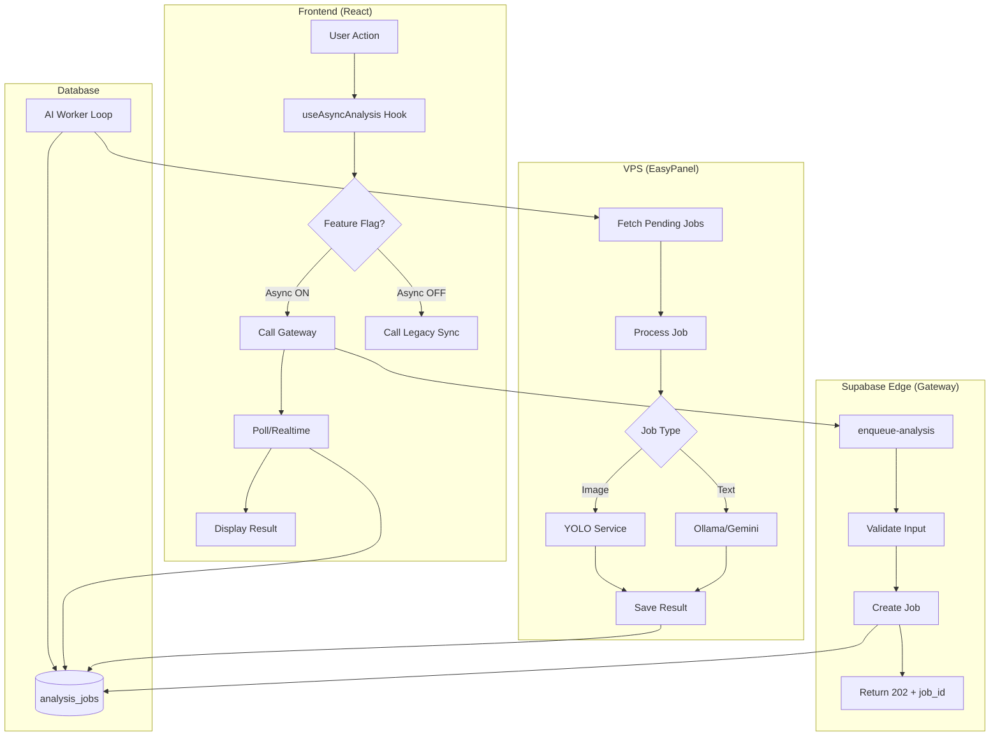

# VPS AI Worker Migration - Design Document

## 📐 Architecture Overview

### System Components



## 🗄️ Database Design

### Table: analysis_jobs

**Purpose**: Queue de jobs assíncronos para processamento de IA

**Columns**:

| Column | Type | Description | Constraints |
|--------|------|-------------|-------------|
| id | UUID | Primary key | PK, default gen_random_uuid() |
| user_id | UUID | User who created job | FK auth.users, NOT NULL |
| type | TEXT | Job type | CHECK IN ('sofia_image', 'medical_exam', ...) |
| input | JSONB | Job input data | NOT NULL |
| status | TEXT | Current status | CHECK IN ('pending', 'processing', ...) |
| priority | INTEGER | Job priority (1-10) | DEFAULT 5 |
| attempts | INTEGER | Retry count | DEFAULT 0 |
| max_attempts | INTEGER | Max retries | DEFAULT 3 |
| result | JSONB | Job result | NULL until completed |
| error | TEXT | Error message | NULL if successful |
| processing_time_ms | INTEGER | Duration | NULL until completed |
| worker_id | TEXT | Worker that processed | NULL until processing |
| created_at | TIMESTAMPTZ | Creation time | DEFAULT NOW() |
| updated_at | TIMESTAMPTZ | Last update | DEFAULT NOW() |
| started_at | TIMESTAMPTZ | Processing start | NULL until processing |
| completed_at | TIMESTAMPTZ | Completion time | NULL until completed |

**Indexes**:
- `idx_jobs_status_priority` ON (status, priority, created_at) - Worker polling
- `idx_jobs_user_created` ON (user_id, created_at DESC) - User job history
- `idx_jobs_type_status` ON (type, status) - Analytics

**RLS Policies**:
- Users can SELECT own jobs (auth.uid() = user_id)
- Service role has full access (for Edge Functions and Worker)

### Table: analysis_cache

**Purpose**: Cache de resultados para evitar reprocessamento

**Columns**:
| Column | Type | Description |
|--------|------|-------------|
| id | UUID | Primary key |
| cache_key | TEXT | Hash of input (UNIQUE) |
| type | TEXT | Job type |
| response | JSONB | Cached result |
| hit_count | INTEGER | Cache hits |
| last_hit_at | TIMESTAMPTZ | Last access |
| expires_at | TIMESTAMPTZ | Expiration time |
| created_at | TIMESTAMPTZ | Creation time |

**Cache Key Generation**:
```typescript
function generateCacheKey(type: string, input: any): string {
  const normalized = JSON.stringify(input, Object.keys(input).sort());
  return `${type}:${sha256(normalized)}`;
}
```

## 🔌 API Design

### Gateway API (Supabase Edge Functions)

#### POST /functions/enqueue-analysis

**Purpose**: Enfileirar job de análise (gateway rápido)

**Request**:
```typescript
{
  type: 'sofia_image' | 'medical_exam' | 'unified_assistant' | ...,
  input: {
    // Type-specific input
    imageUrl?: string,
    message?: string,
    userId: string,
    // ...
  },
  priority?: number, // 1-10, default 5
  useCache?: boolean // default true
}
```

**Response (202 Accepted)**:
```typescript
{
  jobId: string,
  status: 'pending',
  estimatedTime: number, // seconds
  pollUrl: string // /functions/get-analysis-status?jobId=...
}
```

**Response (200 OK - Cache Hit)**:
```typescript
{
  jobId: null,
  status: 'completed',
  result: { /* cached result */ },
  cached: true
}
```

**Response (400 Bad Request)**:
```typescript
{
  error: string,
  details: any
}
```

**Response (503 Service Unavailable - Fallback)**:
```typescript
{
  error: 'Worker unavailable, using fallback',
  fallbackResult: { /* sync result */ }
}
```

#### GET /functions/get-analysis-status

**Purpose**: Consultar status de job

**Query Params**:
- `jobId` (required): UUID do job

**Response (200 OK)**:
```typescript
{
  jobId: string,
  status: 'pending' | 'processing' | 'completed' | 'failed' | 'cancelled',
  progress?: number, // 0-100
  result?: any, // if completed
  error?: string, // if failed
  createdAt: string,
  startedAt?: string,
  completedAt?: string,
  processingTime?: number // ms
}
```

### Worker API (VPS Node.js Service)

#### GET /health

**Purpose**: Health check básico

**Response (200 OK)**:
```typescript
{
  status: 'healthy',
  uptime: number, // seconds
  version: string
}
```

#### GET /health/detailed

**Purpose**: Health check detalhado

**Response (200 OK)**:
```typescript
{
  status: 'healthy' | 'degraded' | 'unhealthy',
  uptime: number,
  version: string,
  worker: {
    id: string,
    concurrency: number,
    activeJobs: number,
    queueSize: number
  },
  services: {
    database: { status: 'up' | 'down', latency: number },
    yolo: { status: 'up' | 'down', latency: number },
    ollama: { status: 'up' | 'down', latency: number },
    gemini: { status: 'up' | 'down', latency: number }
  },
  metrics: {
    jobsProcessed: number,
    jobsFailed: number,
    avgProcessingTime: number,
    cacheHitRate: number
  }
}
```

#### GET /metrics

**Purpose**: Métricas Prometheus-style

**Response (200 OK)**:
```
# HELP jobs_processed_total Total jobs processed
# TYPE jobs_processed_total counter
jobs_processed_total{type="sofia_image"} 1234
jobs_processed_total{type="medical_exam"} 567

# HELP jobs_failed_total Total jobs failed
# TYPE jobs_failed_total counter
jobs_failed_total{type="sofia_image"} 12

# HELP job_processing_duration_seconds Job processing duration
# TYPE job_processing_duration_seconds histogram
job_processing_duration_seconds_bucket{type="sofia_image",le="5"} 100
job_processing_duration_seconds_bucket{type="sofia_image",le="10"} 450
job_processing_duration_seconds_bucket{type="sofia_image",le="15"} 890
```

## 🔄 Worker Processing Logic

### Main Loop

```typescript
class AIWorker {
  private concurrency: number = 5;
  private activeJobs: Set<string> = new Set();
  private pollInterval: number = 1000; // ms
  
  async start() {
    console.log(`🚀 Worker ${this.workerId} started`);
    
    while (true) {
      try {
        // 1. Check if we can process more jobs
        if (this.activeJobs.size >= this.concurrency) {
          await sleep(this.pollInterval);
          continue;
        }
        
        // 2. Fetch pending jobs
        const availableSlots = this.concurrency - this.activeJobs.size;
        const jobs = await this.fetchPendingJobs(availableSlots);
        
        if (jobs.length === 0) {
          await sleep(this.pollInterval);
          continue;
        }
        
        // 3. Process jobs in parallel
        for (const job of jobs) {
          this.processJob(job); // Fire and forget
        }
        
      } catch (error) {
        console.error('Worker loop error:', error);
        await sleep(5000); // Backoff on error
      }
    }
  }
  
  private async fetchPendingJobs(limit: number) {
    const { data, error } = await supabase
      .from('analysis_jobs')
      .select('*')
      .eq('status', 'pending')
      .order('priority', { ascending: true })
      .order('created_at', { ascending: true })
      .limit(limit);
    
    if (error) throw error;
    return data || [];
  }
  
  private async processJob(job: Job) {
    this.activeJobs.add(job.id);
    
    try {
      // 1. Mark as processing
      await this.updateJobStatus(job.id, 'processing', {
        started_at: new Date().toISOString(),
        worker_id: this.workerId
      });
      
      // 2. Process based on type
      const result = await this.processJobByType(job);
      
      // 3. Mark as completed
      await this.updateJobStatus(job.id, 'completed', {
        result,
        completed_at: new Date().toISOString(),
        processing_time_ms: Date.now() - new Date(job.started_at).getTime()
      });
      
      // 4. Cache result
      await this.cacheResult(job, result);
      
    } catch (error) {
      // Handle retry logic
      await this.handleJobError(job, error);
    } finally {
      this.activeJobs.delete(job.id);
    }
  }
}
```

### Job Type Handlers

```typescript
async processJobByType(job: Job): Promise<any> {
  switch (job.type) {
    case 'sofia_image':
      return await this.processSofiaImage(job.input);
    
    case 'medical_exam':
      return await this.processMedicalExam(job.input);
    
    case 'unified_assistant':
      return await this.processUnifiedAssistant(job.input);
    
    case 'meal_plan':
      return await this.processMealPlan(job.input);
    
    default:
      throw new Error(`Unknown job type: ${job.type}`);
  }
}

async processSofiaImage(input: any): Promise<any> {
  // 1. Call YOLO for object detection
  const yoloResult = await this.callYolo(input.imageUrl);
  
  // 2. Call Gemini with YOLO context
  const geminiResult = await this.callGemini({
    imageUrl: input.imageUrl,
    yoloContext: yoloResult,
    prompt: 'Analyze this food image...'
  });
  
  // 3. Process and format result
  return this.formatSofiaResult(geminiResult, yoloResult);
}
```

### Retry Logic

```typescript
async handleJobError(job: Job, error: Error) {
  const attempts = job.attempts + 1;
  
  if (attempts >= job.max_attempts) {
    // Max retries reached - mark as failed
    await this.updateJobStatus(job.id, 'failed', {
      error: error.message,
      attempts,
      completed_at: new Date().toISOString()
    });
    return;
  }
  
  // Retry with exponential backoff
  const delay = Math.min(1000 * Math.pow(2, attempts), 30000);
  
  await this.updateJobStatus(job.id, 'pending', {
    attempts,
    error: `Retry ${attempts}/${job.max_attempts}: ${error.message}`
  });
  
  console.log(`⏳ Job ${job.id} will retry in ${delay}ms`);
}
```

## 🎨 Frontend Integration

### Hook: useAsyncAnalysis

```typescript
interface UseAsyncAnalysisOptions {
  type: JobType;
  enabled?: boolean;
  pollInterval?: number;
  onSuccess?: (result: any) => void;
  onError?: (error: Error) => void;
}

function useAsyncAnalysis(options: UseAsyncAnalysisOptions) {
  const [jobId, setJobId] = useState<string | null>(null);
  const [status, setStatus] = useState<JobStatus>('idle');
  const [result, setResult] = useState<any>(null);
  const [error, setError] = useState<Error | null>(null);
  
  // Feature flag check
  const useAsync = useMemo(() => {
    switch (options.type) {
      case 'sofia_image': return import.meta.env.VITE_USE_ASYNC_SOFIA === 'true';
      case 'medical_exam': return import.meta.env.VITE_USE_ASYNC_EXAMS === 'true';
      default: return false;
    }
  }, [options.type]);
  
  // Enqueue job
  const enqueue = useCallback(async (input: any) => {
    if (!useAsync) {
      // Fallback to sync
      return await callSyncFunction(options.type, input);
    }
    
    try {
      setStatus('enqueuing');
      
      const { data, error } = await supabase.functions.invoke('enqueue-analysis', {
        body: { type: options.type, input }
      });
      
      if (error) throw error;
      
      if (data.cached) {
        // Cache hit - return immediately
        setResult(data.result);
        setStatus('completed');
        options.onSuccess?.(data.result);
        return data.result;
      }
      
      // Job enqueued - start polling
      setJobId(data.jobId);
      setStatus('pending');
      
    } catch (err) {
      setError(err);
      setStatus('error');
      options.onError?.(err);
    }
  }, [useAsync, options]);
  
  // Poll for status
  useEffect(() => {
    if (!jobId || status === 'completed' || status === 'error') return;
    
    const interval = setInterval(async () => {
      try {
        const { data } = await supabase.functions.invoke('get-analysis-status', {
          body: { jobId }
        });
        
        setStatus(data.status);
        
        if (data.status === 'completed') {
          setResult(data.result);
          options.onSuccess?.(data.result);
        } else if (data.status === 'failed') {
          setError(new Error(data.error));
          options.onError?.(new Error(data.error));
        }
        
      } catch (err) {
        console.error('Polling error:', err);
      }
    }, options.pollInterval || 2000);
    
    return () => clearInterval(interval);
  }, [jobId, status]);
  
  // Cancel job
  const cancel = useCallback(async () => {
    if (!jobId) return;
    
    await supabase
      .from('analysis_jobs')
      .update({ status: 'cancelled' })
      .eq('id', jobId);
    
    setStatus('cancelled');
  }, [jobId]);
  
  return {
    enqueue,
    cancel,
    status,
    result,
    error,
    isLoading: ['enqueuing', 'pending', 'processing'].includes(status)
  };
}
```

### Component Example: QuickPhotoCapture (Migrated)

```typescript
function QuickPhotoCapture() {
  const { enqueue, status, result, error, isLoading, cancel } = useAsyncAnalysis({
    type: 'sofia_image',
    onSuccess: (result) => {
      toast.success('Análise concluída!');
      // Handle result
    },
    onError: (error) => {
      toast.error('Erro na análise');
    }
  });
  
  const handleCapture = async (imageUrl: string) => {
    await enqueue({
      imageUrl,
      mealType: selectedMealType,
      userId: user.id
    });
  };
  
  return (
    <div>
      <Camera onCapture={handleCapture} />
      
      {isLoading && (
        <div className="loading-state">
          <Spinner />
          <p>Analisando imagem...</p>
          <p className="text-sm text-muted-foreground">
            {status === 'enqueuing' && 'Enviando...'}
            {status === 'pending' && 'Na fila...'}
            {status === 'processing' && 'Processando...'}
          </p>
          <Button variant="outline" onClick={cancel}>
            Cancelar
          </Button>
        </div>
      )}
      
      {result && <ResultDisplay result={result} />}
      {error && <ErrorDisplay error={error} />}
    </div>
  );
}
```

## 🔐 Security Considerations

### Authentication Flow

1. **Frontend → Gateway**: User JWT (auth.uid())
2. **Gateway → Database**: SERVICE_ROLE_KEY (create job)
3. **Worker → Database**: SERVICE_ROLE_KEY (process job)
4. **Frontend → Database**: User JWT (read own jobs via RLS)

### Data Sanitization

```typescript
function sanitizeInput(input: any): any {
  // Remove sensitive fields
  const { password, token, apiKey, ...safe } = input;
  
  // Validate URLs
  if (input.imageUrl) {
    const url = new URL(input.imageUrl);
    if (!['https:', 'http:'].includes(url.protocol)) {
      throw new Error('Invalid image URL protocol');
    }
  }
  
  return safe;
}
```

### Rate Limiting

```typescript
// Per user: max 10 concurrent jobs
async function checkUserRateLimit(userId: string): Promise<boolean> {
  const { count } = await supabase
    .from('analysis_jobs')
    .select('*', { count: 'exact', head: true })
    .eq('user_id', userId)
    .in('status', ['pending', 'processing']);
  
  return count < 10;
}
```

## 📊 Monitoring & Observability

### Metrics to Track

| Metric | Type | Description | Alert Threshold |
|--------|------|-------------|-----------------|
| `jobs_enqueued_total` | Counter | Total jobs enqueued | - |
| `jobs_completed_total` | Counter | Total jobs completed | - |
| `jobs_failed_total` | Counter | Total jobs failed | > 5% of completed |
| `job_processing_duration_seconds` | Histogram | Processing time | p95 > 30s |
| `worker_active_jobs` | Gauge | Currently processing | > concurrency |
| `worker_queue_size` | Gauge | Pending jobs | > 50 |
| `cache_hit_rate` | Gauge | Cache hit % | < 20% |
| `gateway_latency_seconds` | Histogram | Gateway response time | p95 > 500ms |

### Logging Structure

```typescript
interface LogEntry {
  timestamp: string;
  level: 'info' | 'warn' | 'error';
  component: 'gateway' | 'worker' | 'frontend';
  jobId?: string;
  userId?: string;
  type?: JobType;
  message: string;
  metadata?: any;
  duration?: number;
}

// Example
logger.info({
  component: 'worker',
  jobId: 'abc-123',
  type: 'sofia_image',
  message: 'Job completed successfully',
  duration: 8500,
  metadata: { yoloTime: 2000, geminiTime: 5500 }
});
```

## 🧪 Testing Strategy

### Unit Tests

```typescript
describe('AIWorker', () => {
  it('should fetch pending jobs ordered by priority', async () => {
    // Test job fetching logic
  });
  
  it('should retry failed jobs with exponential backoff', async () => {
    // Test retry logic
  });
  
  it('should mark stuck jobs as failed after timeout', async () => {
    // Test stuck job detection
  });
});

describe('useAsyncAnalysis', () => {
  it('should enqueue job and poll for status', async () => {
    // Test hook behavior
  });
  
  it('should fallback to sync if feature flag disabled', async () => {
    // Test fallback logic
  });
});
```

### Integration Tests

```typescript
describe('End-to-end flow', () => {
  it('should process sofia_image job successfully', async () => {
    // 1. Enqueue job via gateway
    const { jobId } = await enqueueJob('sofia_image', { imageUrl: '...' });
    
    // 2. Wait for worker to process
    await waitForJobCompletion(jobId, 30000);
    
    // 3. Verify result
    const job = await getJob(jobId);
    expect(job.status).toBe('completed');
    expect(job.result).toHaveProperty('foods');
  });
});
```

### Load Tests (K6)

```javascript
import http from 'k6/http';
import { check, sleep } from 'k6';

export const options = {
  stages: [
    { duration: '1m', target: 10 },  // Ramp up
    { duration: '5m', target: 50 },  // Sustained load
    { duration: '1m', target: 0 },   // Ramp down
  ],
  thresholds: {
    'http_req_duration{type:gateway}': ['p(95)<500'],
    'http_req_duration{type:status}': ['p(95)<200'],
    'job_completion_time': ['p(95)<20000'],
  },
};

export default function () {
  // 1. Enqueue job
  const enqueueRes = http.post(
    `${__ENV.API_URL}/functions/enqueue-analysis`,
    JSON.stringify({
      type: 'sofia_image',
      input: { imageUrl: 'https://example.com/food.jpg' }
    }),
    { tags: { type: 'gateway' } }
  );
  
  check(enqueueRes, {
    'enqueue status is 202': (r) => r.status === 202,
    'enqueue has jobId': (r) => r.json('jobId') !== null,
  });
  
  const jobId = enqueueRes.json('jobId');
  
  // 2. Poll for completion
  let completed = false;
  let attempts = 0;
  const maxAttempts = 30;
  
  while (!completed && attempts < maxAttempts) {
    sleep(2);
    
    const statusRes = http.get(
      `${__ENV.API_URL}/functions/get-analysis-status?jobId=${jobId}`,
      { tags: { type: 'status' } }
    );
    
    const status = statusRes.json('status');
    completed = ['completed', 'failed'].includes(status);
    attempts++;
  }
  
  check({ completed }, {
    'job completed within 60s': (r) => r.completed,
  });
}
```

## 🚀 Deployment Strategy

### Phase 1: Infrastructure Setup

1. Create database tables and indexes
2. Deploy VPS worker to EasyPanel
3. Configure environment variables
4. Run smoke tests

### Phase 2: Gateway Deployment

1. Deploy new Edge Functions (enqueue, get-status)
2. Update existing Edge Functions with fallback logic
3. Deploy with feature flags OFF
4. Verify no regressions

### Phase 3: Frontend Deployment

1. Deploy useAsyncAnalysis hook
2. Migrate QuickPhotoCapture (POC)
3. Deploy with feature flag OFF
4. Verify no regressions

### Phase 4: Gradual Rollout

1. Enable VITE_USE_ASYNC_SOFIA for 10% users (canary)
2. Monitor for 48 hours
3. If metrics good, increase to 50%
4. Monitor for 48 hours
5. If metrics good, increase to 100%

### Phase 5: Cleanup

1. Remove legacy sync code
2. Remove feature flags
3. Update documentation

## 🔄 Rollback Procedures

### Immediate Rollback (< 5 minutes)

```bash
# 1. Disable feature flags
export VITE_USE_ASYNC_SOFIA=false
export VITE_USE_ASYNC_EXAMS=false
export VITE_USE_ASYNC_UNIFIED=false

# 2. Redeploy frontend
npm run build && npm run deploy

# 3. Verify sync flow working
curl -X POST https://api.maxnutrition.com/functions/sofia-image-analysis \
  -H "Authorization: Bearer $TOKEN" \
  -d '{"imageUrl": "..."}'
```

### Partial Rollback (Specific Job Type)

```bash
# Disable only sofia_image async
export VITE_USE_ASYNC_SOFIA=false
# Keep others enabled
export VITE_USE_ASYNC_EXAMS=true
```

## 📈 Success Criteria

### Performance

- ✅ Gateway p95 latency < 200ms
- ✅ Worker p95 completion < 15s
- ✅ End-to-end p95 < 20s
- ✅ Timeout rate < 0.1%

### Reliability

- ✅ Uptime > 99.9%
- ✅ Error rate < 1%
- ✅ Successful rollback in < 5min

### User Experience

- ✅ User satisfaction score > 4.5/5
- ✅ Support tickets < 5/week
- ✅ Zero data loss incidents

---

**Last Updated**: 2026-01-17
**Status**: Draft
**Next Review**: After requirements approval
