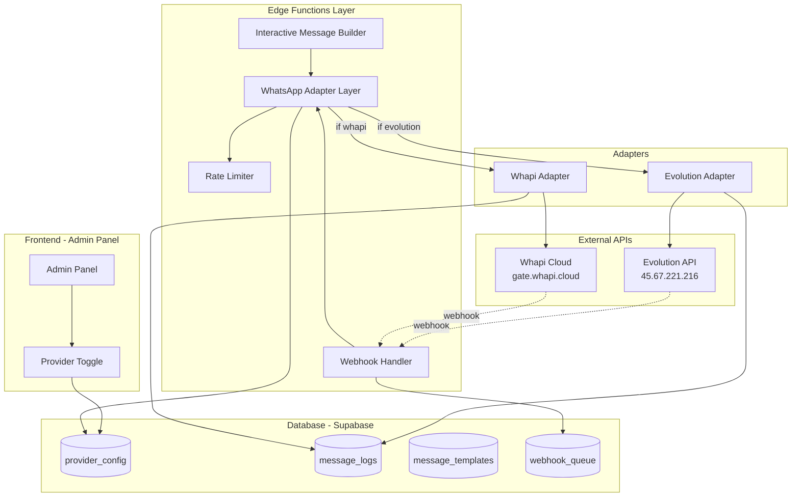
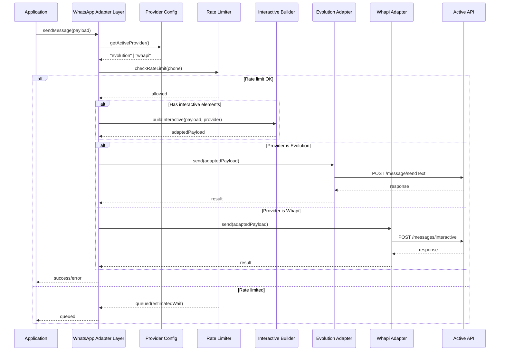
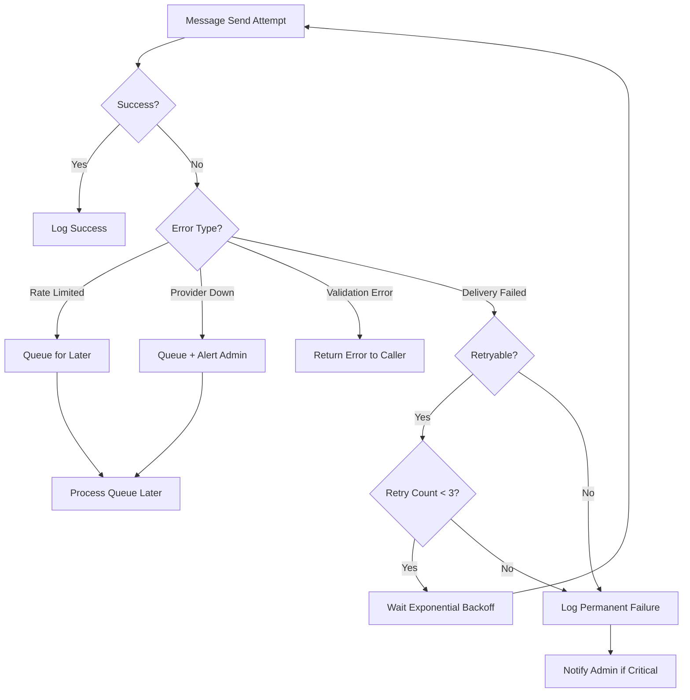

# Design Document: WhatsApp Hybrid Integration

## Overview

Este documento descreve a arquitetura híbrida para integração de WhatsApp que permite alternar dinamicamente entre Evolution API (self-hosted) e Whapi API (cloud com botões interativos). A arquitetura segue o padrão Adapter/Strategy para garantir que apenas uma API esteja ativa por vez, mantendo compatibilidade com templates existentes e aproveitando recursos avançados quando disponíveis.

## Architecture

### High-Level Architecture Diagram



### Message Flow Diagram



## Components and Interfaces

### 1. WhatsApp Adapter Layer (Core)

```typescript
// supabase/functions/_shared/whatsapp/adapter-layer.ts

interface SendMessagePayload {
  phone: string;
  userId?: string;
  messageType: 'text' | 'image' | 'document' | 'audio' | 'video' | 'interactive';
  content: TextContent | MediaContent | InteractiveContent;
  templateKey?: string;
  context?: Record<string, any>;
}

interface TextContent {
  body: string;
  preview_url?: boolean;
}

interface MediaContent {
  url?: string;
  base64?: string;
  caption?: string;
  fileName?: string;
}

interface InteractiveContent {
  type: 'button' | 'list' | 'carousel';
  header?: { text?: string; media?: string };
  body: { text: string };
  footer?: { text: string };
  action: ButtonAction | ListAction | CarouselAction;
}

interface ButtonAction {
  buttons: Array<{
    type: 'quick_reply' | 'call' | 'url';
    id: string;
    title: string;
    payload?: string; // phone_number for call, url for url type
  }>;
}

interface ListAction {
  label: string;
  sections: Array<{
    title: string;
    rows: Array<{
      id: string;
      title: string;
      description?: string;
    }>;
  }>;
}

interface CarouselAction {
  cards: Array<{
    id: string;
    media: string;
    text: string;
    buttons: ButtonAction['buttons'];
  }>;
}

interface SendResult {
  success: boolean;
  messageId?: string;
  provider: 'evolution' | 'whapi';
  error?: string;
  queued?: boolean;
  estimatedWait?: number;
}

class WhatsAppAdapterLayer {
  private supabase: SupabaseClient;
  private rateLimiter: RateLimiter;
  
  async sendMessage(payload: SendMessagePayload): Promise<SendResult>;
  async getActiveProvider(): Promise<'evolution' | 'whapi'>;
  private async routeToAdapter(provider: string, payload: any): Promise<SendResult>;
}
```

### 2. Evolution Adapter

```typescript
// supabase/functions/_shared/whatsapp/evolution-adapter.ts

interface EvolutionConfig {
  apiUrl: string;      // EVOLUTION_API_URL
  apiKey: string;      // EVOLUTION_API_KEY
  instance: string;    // EVOLUTION_INSTANCE
}

class EvolutionAdapter implements WhatsAppProvider {
  async sendText(phone: string, message: string): Promise<SendResult>;
  async sendMedia(phone: string, media: MediaContent): Promise<SendResult>;
  async sendInteractive(phone: string, content: InteractiveContent): Promise<SendResult>;
  async checkConnection(): Promise<ConnectionStatus>;
  
  // Converte botões interativos para texto numerado
  private convertInteractiveToText(content: InteractiveContent): string;
}

// Exemplo de conversão para texto:
// Botões: ["Confirmar", "Corrigir", "Cancelar"]
// Resultado: "1️⃣ Confirmar\n2️⃣ Corrigir\n3️⃣ Cancelar\n\nResponda com o número da opção"
```

### 3. Whapi Adapter

```typescript
// supabase/functions/_shared/whatsapp/whapi-adapter.ts

interface WhapiConfig {
  apiUrl: string;      // https://gate.whapi.cloud
  apiToken: string;    // WHAPI_API_TOKEN
}

class WhapiAdapter implements WhatsAppProvider {
  async sendText(phone: string, message: string): Promise<SendResult>;
  async sendMedia(phone: string, media: MediaContent): Promise<SendResult>;
  async sendInteractive(phone: string, content: InteractiveContent): Promise<SendResult>;
  async sendCarousel(phone: string, cards: CarouselAction): Promise<SendResult>;
  async checkConnection(): Promise<ConnectionStatus>;
  
  // Formata payload para API Whapi
  private formatInteractivePayload(content: InteractiveContent): WhapiInteractivePayload;
}

// Exemplo de payload Whapi para botões:
// {
//   "to": "5511999999999",
//   "type": "button",
//   "body": { "text": "Análise concluída! O que deseja fazer?" },
//   "action": {
//     "buttons": [
//       { "type": "quick_reply", "title": "✅ Confirmar", "id": "confirm_analysis" },
//       { "type": "quick_reply", "title": "✏️ Corrigir", "id": "edit_analysis" },
//       { "type": "quick_reply", "title": "❌ Cancelar", "id": "cancel_analysis" }
//     ]
//   }
// }
```

### 4. Interactive Message Builder

```typescript
// supabase/functions/_shared/whatsapp/interactive-builder.ts

interface InteractiveTemplate {
  id: string;
  name: string;
  type: 'button' | 'list' | 'carousel';
  content: InteractiveContent;
}

class InteractiveMessageBuilder {
  // Templates pré-definidos para fluxos comuns
  static TEMPLATES = {
    FOOD_ANALYSIS_COMPLETE: 'food_analysis_complete',
    EXAM_ANALYSIS_COMPLETE: 'exam_analysis_complete',
    ONBOARDING_STEP: 'onboarding_step',
    DAILY_CHECKIN: 'daily_checkin',
    GOAL_REMINDER: 'goal_reminder',
  };
  
  build(templateId: string, data: Record<string, any>, provider: 'evolution' | 'whapi'): SendMessagePayload;
  
  // Adapta conteúdo baseado no provider
  adaptForProvider(content: InteractiveContent, provider: string): TextContent | InteractiveContent;
  
  // Valida limites (3 botões quick_reply, 10 rows em list, etc)
  validate(content: InteractiveContent): ValidationResult;
}
```

### 5. Rate Limiter

```typescript
// supabase/functions/_shared/whatsapp/rate-limiter.ts

interface RateLimitConfig {
  minDelayMs: number;           // 1200ms entre mensagens
  maxMessagesPerHour: number;   // 200
  maxMessagesPerDay: number;    // 1000
}

interface RateLimitResult {
  allowed: boolean;
  queued: boolean;
  estimatedWaitMs?: number;
  reason?: string;
}

class RateLimiter {
  async checkLimit(phone: string, userId?: string): Promise<RateLimitResult>;
  async recordSent(phone: string, userId?: string): Promise<void>;
  async getQueuePosition(phone: string): Promise<number>;
  
  // Detecta padrões suspeitos
  async detectAnomalies(userId: string): Promise<AnomalyReport>;
}
```

### 6. Webhook Handler

```typescript
// supabase/functions/whatsapp-webhook-handler/index.ts

interface WebhookPayload {
  provider: 'evolution' | 'whapi';
  event: 'message' | 'button_reply' | 'list_reply' | 'status';
  data: EvolutionWebhook | WhapiWebhook;
}

interface ButtonReplyData {
  messageId: string;
  buttonId: string;
  buttonTitle: string;
  from: string;
  timestamp: number;
}

class WebhookHandler {
  async handleIncoming(payload: WebhookPayload): Promise<void>;
  
  // Processa clique em botão
  async handleButtonReply(data: ButtonReplyData): Promise<void>;
  
  // Mapeia buttonId para ação
  private async executeAction(buttonId: string, userId: string): Promise<void>;
  
  // Ações disponíveis
  private actions = {
    'confirm_analysis': this.confirmFoodAnalysis,
    'edit_analysis': this.editFoodAnalysis,
    'cancel_analysis': this.cancelFoodAnalysis,
    'view_details': this.sendDetailedReport,
    'talk_nutritionist': this.scheduleConsultation,
  };
}
```

## Data Models

### Provider Configuration Table

```sql
-- Tabela de configuração do provider ativo
CREATE TABLE whatsapp_provider_config (
  id UUID PRIMARY KEY DEFAULT gen_random_uuid(),
  active_provider TEXT NOT NULL CHECK (active_provider IN ('evolution', 'whapi')),
  evolution_enabled BOOLEAN DEFAULT true,
  whapi_enabled BOOLEAN DEFAULT false,
  
  -- Configurações Evolution
  evolution_api_url TEXT,
  evolution_instance TEXT,
  evolution_last_health_check TIMESTAMPTZ,
  evolution_health_status TEXT,
  
  -- Configurações Whapi
  whapi_api_url TEXT DEFAULT 'https://gate.whapi.cloud',
  whapi_last_health_check TIMESTAMPTZ,
  whapi_health_status TEXT,
  
  -- Controle
  updated_at TIMESTAMPTZ DEFAULT NOW(),
  updated_by UUID REFERENCES auth.users(id),
  
  -- Singleton pattern
  CONSTRAINT single_config CHECK (id = '00000000-0000-0000-0000-000000000001')
);

-- Inserir configuração inicial
INSERT INTO whatsapp_provider_config (id, active_provider)
VALUES ('00000000-0000-0000-0000-000000000001', 'evolution')
ON CONFLICT (id) DO NOTHING;
```

### Message Logs Table

```sql
-- Logs unificados de mensagens (ambos providers)
CREATE TABLE whatsapp_message_logs (
  id UUID PRIMARY KEY DEFAULT gen_random_uuid(),
  user_id UUID REFERENCES auth.users(id),
  phone TEXT NOT NULL,
  provider TEXT NOT NULL CHECK (provider IN ('evolution', 'whapi')),
  
  -- Tipo e conteúdo
  message_type TEXT NOT NULL, -- text, image, interactive, etc
  message_content TEXT,
  interactive_type TEXT, -- button, list, carousel
  template_key TEXT,
  
  -- Resposta da API
  provider_message_id TEXT,
  provider_response JSONB,
  
  -- Status
  status TEXT NOT NULL DEFAULT 'pending', -- pending, sent, delivered, read, failed
  error_message TEXT,
  retry_count INTEGER DEFAULT 0,
  
  -- Timestamps
  created_at TIMESTAMPTZ DEFAULT NOW(),
  sent_at TIMESTAMPTZ,
  delivered_at TIMESTAMPTZ,
  read_at TIMESTAMPTZ
);

CREATE INDEX idx_message_logs_user ON whatsapp_message_logs(user_id);
CREATE INDEX idx_message_logs_phone ON whatsapp_message_logs(phone);
CREATE INDEX idx_message_logs_created ON whatsapp_message_logs(created_at DESC);
CREATE INDEX idx_message_logs_status ON whatsapp_message_logs(status);
```

### Webhook Responses Table

```sql
-- Respostas de webhooks (cliques em botões, etc)
CREATE TABLE whatsapp_webhook_responses (
  id UUID PRIMARY KEY DEFAULT gen_random_uuid(),
  user_id UUID REFERENCES auth.users(id),
  phone TEXT NOT NULL,
  provider TEXT NOT NULL,
  
  -- Dados da resposta
  original_message_id TEXT,
  response_type TEXT NOT NULL, -- button_reply, list_reply, text
  button_id TEXT,
  button_title TEXT,
  list_row_id TEXT,
  raw_payload JSONB,
  
  -- Ação executada
  action_triggered TEXT,
  action_result JSONB,
  
  -- Timestamps
  received_at TIMESTAMPTZ DEFAULT NOW(),
  processed_at TIMESTAMPTZ
);

CREATE INDEX idx_webhook_responses_user ON whatsapp_webhook_responses(user_id);
CREATE INDEX idx_webhook_responses_message ON whatsapp_webhook_responses(original_message_id);
```

### Rate Limit Tracking Table

```sql
-- Tracking de rate limit
CREATE TABLE whatsapp_rate_limit_tracking (
  id UUID PRIMARY KEY DEFAULT gen_random_uuid(),
  phone TEXT NOT NULL,
  user_id UUID REFERENCES auth.users(id),
  
  -- Contadores
  messages_last_minute INTEGER DEFAULT 0,
  messages_last_hour INTEGER DEFAULT 0,
  messages_today INTEGER DEFAULT 0,
  last_message_at TIMESTAMPTZ,
  
  -- Controle
  tracking_date DATE DEFAULT CURRENT_DATE,
  updated_at TIMESTAMPTZ DEFAULT NOW(),
  
  UNIQUE(phone, tracking_date)
);

CREATE INDEX idx_rate_limit_phone ON whatsapp_rate_limit_tracking(phone);
```

## Correctness Properties

*A property is a characteristic or behavior that should hold true across all valid executions of a system-essentially, a formal statement about what the system should do. Properties serve as the bridge between human-readable specifications and machine-verifiable correctness guarantees.*

### Property 1: Provider Mutual Exclusion

*For any* provider toggle action, exactly one provider SHALL be active at any time. If Evolution is activated, Whapi must be inactive, and vice versa.

**Validates: Requirements 1.2, 1.3**

### Property 2: Provider Configuration Persistence Round-Trip

*For any* provider configuration change, saving to database and then reading back SHALL return the same active provider value.

**Validates: Requirements 1.4**

### Property 3: Provider Routing Correctness

*For any* message sent through the WhatsApp_Adapter_Layer, the message SHALL be routed exclusively to the currently active provider's adapter, and never to the inactive provider.

**Validates: Requirements 1.5, 2.2, 2.5**

### Property 4: Message Type Support Completeness

*For any* message type in the set {text, image, document, audio, video, interactive}, the WhatsApp_Adapter_Layer SHALL accept and process the message without type-related errors.

**Validates: Requirements 2.3**

### Property 5: Interactive Fallback Conversion

*For any* interactive message content when Evolution_API is active, the output SHALL be converted to plain text with numbered options that preserve the semantic meaning of the original buttons/list items.

**Validates: Requirements 2.6, 3.6, 5.3, 6.6**

### Property 6: Phone Number Formatting

*For any* input phone number (with or without country code, with or without formatting characters), the Evolution_Adapter SHALL output a phone number in Brazilian standard format: 55 + DDD + number (digits only).

**Validates: Requirements 3.3**

### Property 7: Adapter Logging Completeness

*For any* message sent through either adapter, a corresponding log entry SHALL be created in the appropriate logs table containing: user_id, phone, message_type, provider_response, and timestamp.

**Validates: Requirements 3.4, 4.7, 11.1, 11.2, 11.3**

### Property 8: Error Response Structure

*For any* error returned by either provider API, the adapter SHALL return a structured error object containing at minimum: success=false, error message, and HTTP status code.

**Validates: Requirements 3.5, 4.8**

### Property 9: Whapi Interactive Limits Validation

*For any* interactive message sent via Whapi_Adapter, the system SHALL validate that: quick_reply buttons <= 3, list rows <= 10 per section, carousel cards <= 10. Messages exceeding limits SHALL be rejected with validation error.

**Validates: Requirements 4.3, 4.6, 5.6**

### Property 10: Button ID Preservation

*For any* interactive message with button IDs, the output message (whether native interactive or text fallback) SHALL preserve all original button IDs for webhook response matching.

**Validates: Requirements 5.4**

### Property 11: Webhook Response Extraction

*For any* webhook callback containing a button click or list selection, the Webhook_Handler SHALL correctly extract the button_id/row_id and the associated title/description.

**Validates: Requirements 7.2, 7.3**

### Property 12: Webhook Context Matching

*For any* webhook response with a valid original_message_id, the Webhook_Handler SHALL successfully match it to the original message context and retrieve associated user_id.

**Validates: Requirements 7.4**

### Property 13: Rate Limiting Enforcement

*For any* sequence of messages to the same phone number, the Rate_Limiter SHALL enforce: minimum 1.2 second delay between messages, maximum 200 messages per hour, and queue messages that exceed limits with estimated wait time.

**Validates: Requirements 8.1, 8.2, 8.3, 8.4**

### Property 14: Template Placeholder Substitution

*For any* message template containing placeholders {{nome}}, {{peso}}, {{calorias}}, {{data}} and corresponding data values, the output message SHALL have all placeholders replaced with actual values.

**Validates: Requirements 9.3**

### Property 15: Template Provider Agnostic

*For any* message template, switching the active provider SHALL NOT require changes to the template itself - the same template SHALL work with both Evolution and Whapi.

**Validates: Requirements 9.6**

### Property 16: No Auto-Switch on Provider Failure

*For any* provider health check failure or connection issue, the system SHALL NOT automatically switch to the other provider. The active provider SHALL remain unchanged until explicit admin action.

**Validates: Requirements 10.6**

### Property 17: Graceful Degradation with Retry

*For any* failed message send attempt, the system SHALL: (1) retry up to 3 times with exponential backoff, (2) fall back to simpler message format if interactive fails, (3) queue for later if provider unavailable, (4) never lose the message - it must eventually be sent or logged as permanently failed.

**Validates: Requirements 12.1, 12.2, 12.3, 12.4, 12.6**


## Error Handling

### Error Categories

```typescript
enum WhatsAppErrorCode {
  // Provider Errors
  PROVIDER_UNAVAILABLE = 'PROVIDER_UNAVAILABLE',
  PROVIDER_AUTH_FAILED = 'PROVIDER_AUTH_FAILED',
  PROVIDER_RATE_LIMITED = 'PROVIDER_RATE_LIMITED',
  
  // Validation Errors
  INVALID_PHONE_FORMAT = 'INVALID_PHONE_FORMAT',
  INVALID_MESSAGE_TYPE = 'INVALID_MESSAGE_TYPE',
  BUTTON_LIMIT_EXCEEDED = 'BUTTON_LIMIT_EXCEEDED',
  CAROUSEL_LIMIT_EXCEEDED = 'CAROUSEL_LIMIT_EXCEEDED',
  
  // Delivery Errors
  NUMBER_NOT_ON_WHATSAPP = 'NUMBER_NOT_ON_WHATSAPP',
  MESSAGE_REJECTED = 'MESSAGE_REJECTED',
  MEDIA_TOO_LARGE = 'MEDIA_TOO_LARGE',
  
  // Internal Errors
  TEMPLATE_NOT_FOUND = 'TEMPLATE_NOT_FOUND',
  DATABASE_ERROR = 'DATABASE_ERROR',
  WEBHOOK_PROCESSING_FAILED = 'WEBHOOK_PROCESSING_FAILED',
}

interface WhatsAppError {
  code: WhatsAppErrorCode;
  message: string;
  provider: 'evolution' | 'whapi';
  httpStatus?: number;
  retryable: boolean;
  originalError?: any;
}
```

### Error Handling Strategy



### Retry Configuration

```typescript
const RETRY_CONFIG = {
  maxRetries: 3,
  baseDelayMs: 1000,
  maxDelayMs: 30000,
  backoffMultiplier: 2,
  
  // Erros que permitem retry
  retryableErrors: [
    'PROVIDER_UNAVAILABLE',
    'PROVIDER_RATE_LIMITED',
    'MESSAGE_REJECTED', // Pode ser temporário
  ],
  
  // Erros que NÃO permitem retry
  nonRetryableErrors: [
    'INVALID_PHONE_FORMAT',
    'NUMBER_NOT_ON_WHATSAPP',
    'BUTTON_LIMIT_EXCEEDED',
    'TEMPLATE_NOT_FOUND',
  ],
};
```

## Testing Strategy

### Unit Tests

Unit tests verificam componentes individuais em isolamento:

1. **Phone Formatter Tests**
   - Input com código de país → output correto
   - Input sem código de país → adiciona 55
   - Input com caracteres especiais → remove e formata
   - Edge cases: números curtos, longos, inválidos

2. **Interactive Message Builder Tests**
   - Conversão de botões para Whapi format
   - Conversão de botões para texto numerado (Evolution fallback)
   - Validação de limites (3 botões, 10 rows)
   - Preservação de button IDs

3. **Rate Limiter Tests**
   - Primeira mensagem → permitida
   - Mensagem dentro do delay → bloqueada
   - Mensagem após delay → permitida
   - Limite horário atingido → queueada

4. **Template Processor Tests**
   - Substituição de placeholders simples
   - Placeholders ausentes no data → mantém placeholder ou remove
   - Seções condicionais

### Property-Based Tests

Property-based tests validam propriedades universais com inputs gerados:

1. **Property 1: Provider Mutual Exclusion**
   - Gerar sequência aleatória de toggles
   - Verificar que após cada toggle, exatamente um provider está ativo
   - Framework: fast-check
   - Mínimo 100 iterações

2. **Property 3: Provider Routing Correctness**
   - Gerar mensagens aleatórias e configurações de provider
   - Verificar que mensagem sempre vai para provider ativo
   - Mock dos adapters para verificar chamadas

3. **Property 5: Interactive Fallback Conversion**
   - Gerar conteúdo interativo aleatório (1-3 botões, 1-10 rows)
   - Converter para texto
   - Verificar que todos os botões aparecem numerados no texto

4. **Property 6: Phone Number Formatting**
   - Gerar números de telefone em vários formatos
   - Verificar que output sempre é 55 + 11 dígitos

5. **Property 10: Button ID Preservation**
   - Gerar mensagens interativas com IDs aleatórios
   - Processar através do builder
   - Verificar que todos IDs originais estão presentes no output

6. **Property 13: Rate Limiting Enforcement**
   - Gerar sequência de mensagens com timestamps
   - Verificar que rate limits são respeitados

7. **Property 14: Template Placeholder Substitution**
   - Gerar templates com placeholders aleatórios
   - Gerar dados correspondentes
   - Verificar que nenhum placeholder permanece no output

### Integration Tests

1. **Evolution API Integration**
   - Enviar mensagem de texto real (ambiente de teste)
   - Verificar resposta e log

2. **Whapi API Integration**
   - Enviar mensagem interativa real
   - Verificar resposta e log

3. **Webhook Flow**
   - Simular callback de botão clicado
   - Verificar que ação correta é executada

4. **Provider Switch Flow**
   - Alternar provider via admin
   - Enviar mensagem
   - Verificar que usa provider correto

### Test Configuration

```typescript
// vitest.config.ts additions
export default defineConfig({
  test: {
    // Property-based tests podem demorar mais
    testTimeout: 30000,
    
    // Configuração para fast-check
    setupFiles: ['./src/test/setup-pbt.ts'],
  },
});

// setup-pbt.ts
import fc from 'fast-check';

// Configurar número mínimo de iterações
fc.configureGlobal({
  numRuns: 100,
  verbose: true,
});
```

### Test Tags

Cada property test deve ser anotado com referência ao design:

```typescript
describe('WhatsApp Hybrid Integration', () => {
  // Feature: whatsapp-hybrid-integration, Property 1: Provider Mutual Exclusion
  it.prop([fc.array(fc.boolean(), { minLength: 1, maxLength: 50 })])(
    'should maintain exactly one active provider after any sequence of toggles',
    (toggleSequence) => {
      // ... test implementation
    }
  );
  
  // Feature: whatsapp-hybrid-integration, Property 6: Phone Number Formatting
  it.prop([phoneNumberArbitrary])(
    'should format any phone number to Brazilian standard',
    (phone) => {
      const formatted = formatPhone(phone);
      expect(formatted).toMatch(/^55\d{10,11}$/);
    }
  );
});
```

## Security Considerations

1. **API Keys**: Armazenar em Supabase Secrets, nunca em código
2. **Phone Numbers**: Não logar números completos em produção (mascarar)
3. **Message Content**: Criptografar conteúdo sensível em logs
4. **Webhooks**: Validar assinatura/origem dos webhooks
5. **Rate Limiting**: Prevenir abuse por usuários maliciosos
6. **Admin Access**: Apenas admins podem alternar providers

## Performance Considerations

1. **Connection Pooling**: Reutilizar conexões HTTP para APIs
2. **Batch Processing**: Agrupar mensagens quando possível
3. **Async Processing**: Usar filas para mensagens não-urgentes
4. **Caching**: Cache de templates e configurações
5. **Indexes**: Índices otimizados nas tabelas de logs
