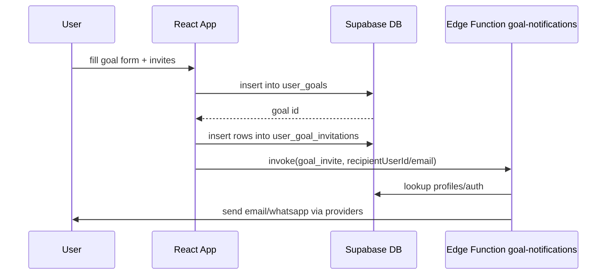

### System Architecture

This document summarizes the frontend, backend (Supabase), and data flows.

#### High-level

```mermaid
graph TD
  A[React App (Vite, TS, Tailwind)] -->|Supabase JS| B[(Supabase Postgres)]
  A --> C[Storage Buckets]
  A --> D[Edge Functions]
  D --> B
  D --> C
```

#### Component overview

```mermaid
graph LR
  subgraph Frontend
    UI[UI Components]
    Admin[Admin Manager]
    Courses[Premium Courses]
    Goals[Goals & Invites]
    Missions[Daily Missions]
    Sessions[Coaching Sessions]
    Wheels[Wheels (Health/Abundance)]
    Saboteurs[Saboteur Test]
    SmartScale[Smart Scale]
  end

  subgraph Supabase
    DB[(Postgres)]
    Storage[(Storage)]
    Edge[Edge Functions]
    Auth[Auth]
  end

  UI --> Auth
  Admin --> DB
  Courses --> DB
  Courses --> Storage
  Goals --> DB
  Missions --> DB
  Sessions --> DB
  Wheels --> DB
  Saboteurs --> DB
  SmartScale --> Edge
  Edge --> DB
  Edge --> Storage
```

#### Sequence: Create Group Goal with Invites



#### Alias Health
- tsconfig paths: `@/*` → `./src/*` (only alias; healthy).
- No other `@components/*` style aliases defined; use relative or `@/components/...`.

#### Key frontend entry points
- Router in `src/App.tsx` defines `/app/courses`, `/app/goals`, `/app/sessions`, `/app/abundance-wheel`, `/app/saboteur-test`, etc.

#### Backend overview
- Database defined via SQL migrations in `supabase/migrations/*`.
- Edge functions under `supabase/functions/*`.
- Storage buckets: avatars, community-uploads, chat-images, course-thumbnails. Policies applied per-bucket.

Security note
- RLS writes for sessions/lessons restricted to admins; admin detected via JWT `app_metadata.role = 'admin'` or `user_metadata.role = 'admin'`.

