# 🗺️ Diagrama de Armazenamento - MaxNutrition

## Visão Geral da Arquitetura

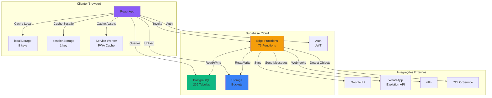

## Fluxo de Dados por Feature

### 1. Análise de Alimentos (Sofia)

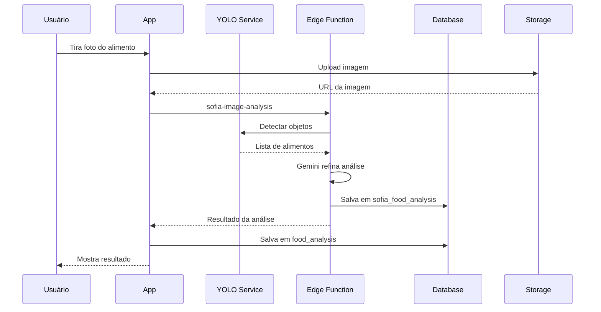

### 2. Análise de Exames (Dr. Vital)

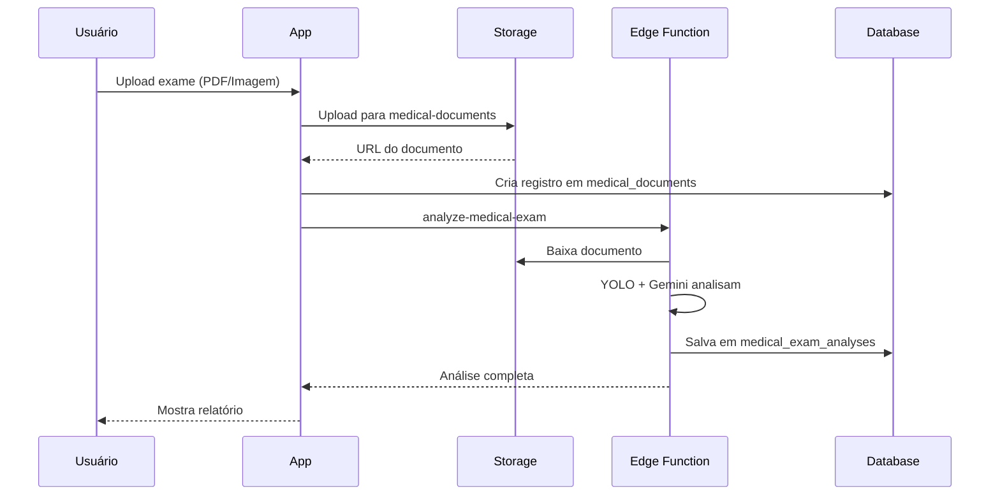

### 3. Tracking Diário

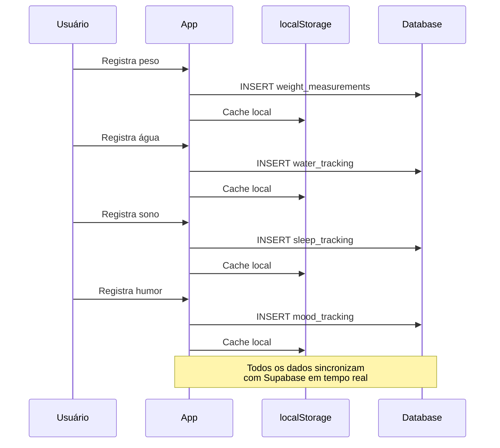

### 4. PWA e Cache Offline

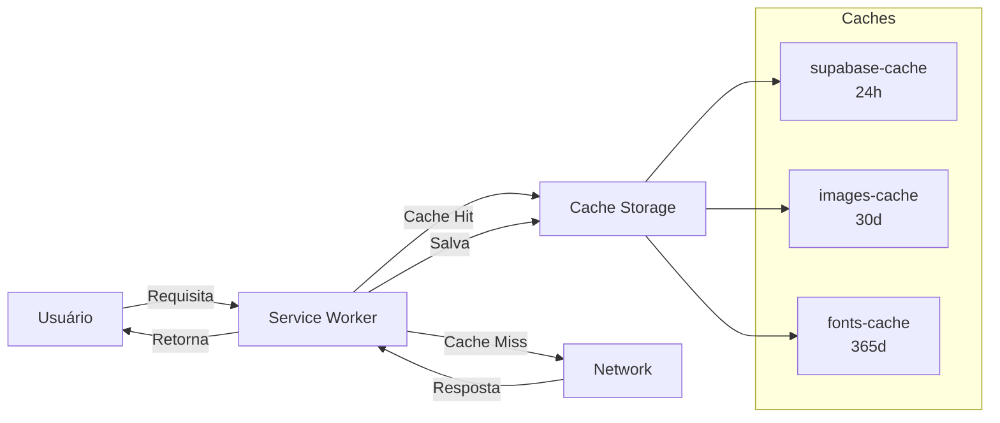

## Distribuição de Dados por Categoria

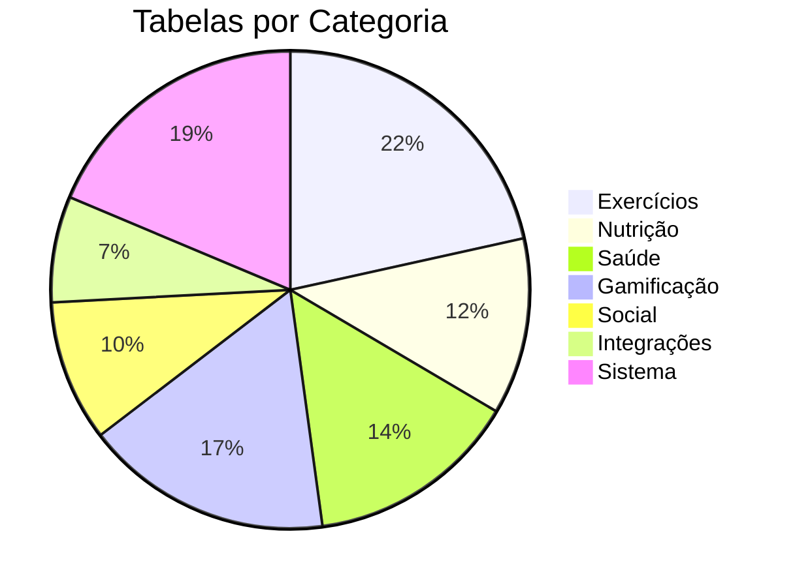

## Armazenamento por Tipo

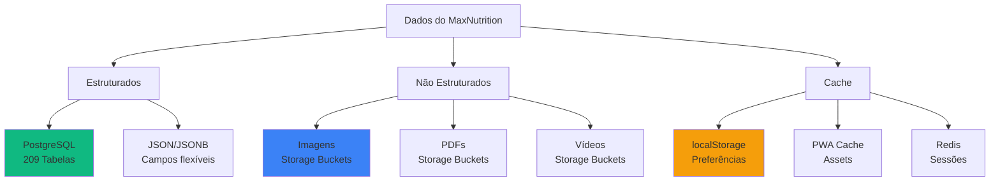

## Ciclo de Vida dos Dados

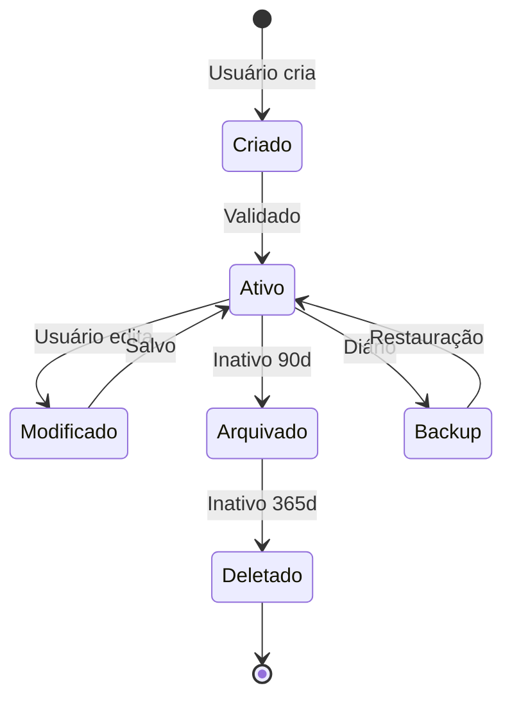

## Políticas de Retenção

| Tipo de Dado | Retenção | Backup | Localização |
|--------------|----------|--------|-------------|
| **Perfil do Usuário** | Permanente | Diário | `profiles` |
| **Dados de Saúde** | Permanente | Diário | `medical_documents`, `health_diary` |
| **Tracking Diário** | 2 anos | Semanal | `advanced_daily_tracking` |
| **Análises de IA** | 1 ano | Mensal | `food_analysis`, `medical_exam_analyses` |
| **Logs de Sistema** | 90 dias | Nenhum | `ai_usage_logs`, `whatsapp_evolution_logs` |
| **Cache de IA** | 7 dias | Nenhum | `ai_response_cache` |
| **Imagens Temporárias** | 30 dias | Nenhum | `image_cache` |
| **Sessões** | Até completar | Nenhum | `user_sessions` |

## Segurança e Acesso

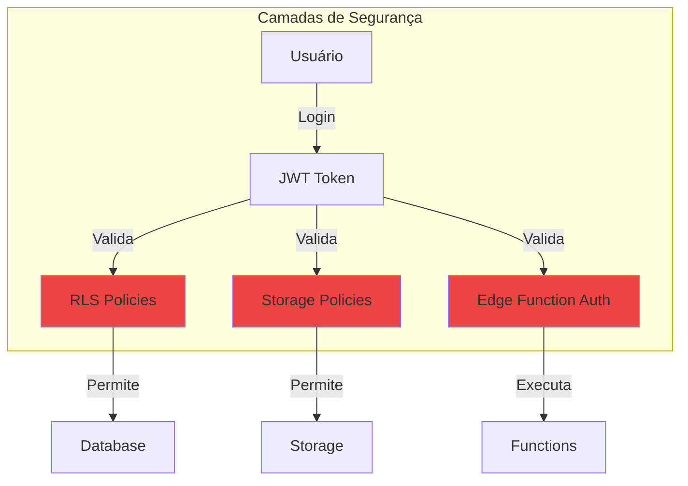

## Monitoramento e Métricas

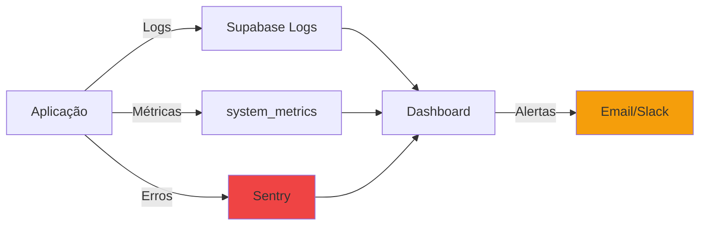

## Escalabilidade

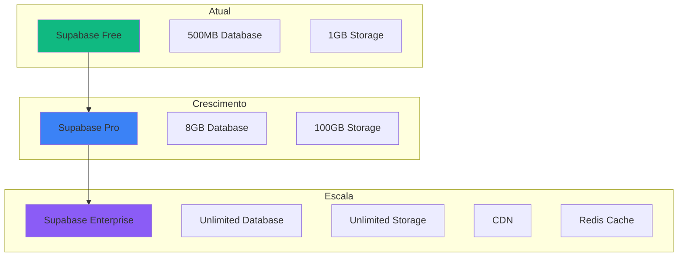

## Backup e Recuperação

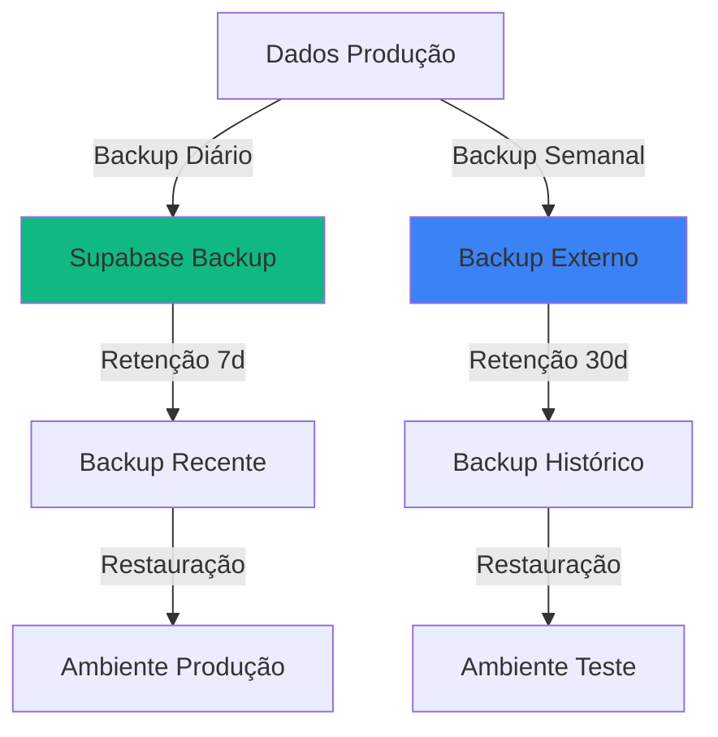

## Otimizações Futuras

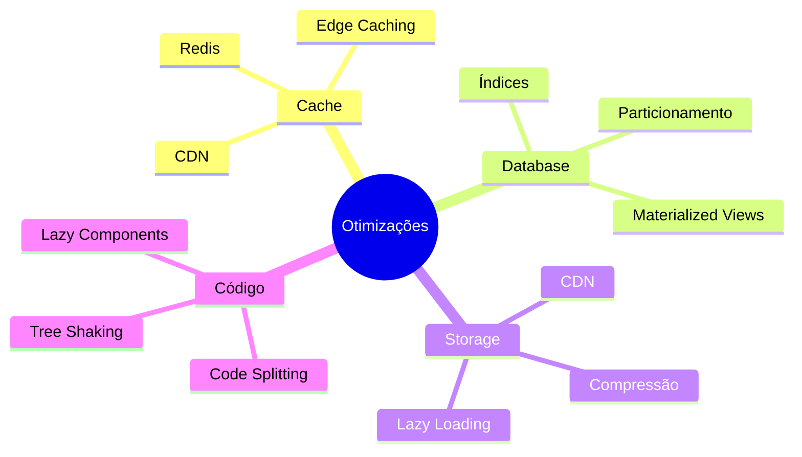

---

**Legenda de Cores:**
- 🟢 Verde: Banco de Dados
- 🔵 Azul: Storage/Arquivos
- 🟠 Laranja: Cache/Temporário
- 🟣 Roxo: Frontend/Cliente
- 🔴 Vermelho: Segurança/Crítico
