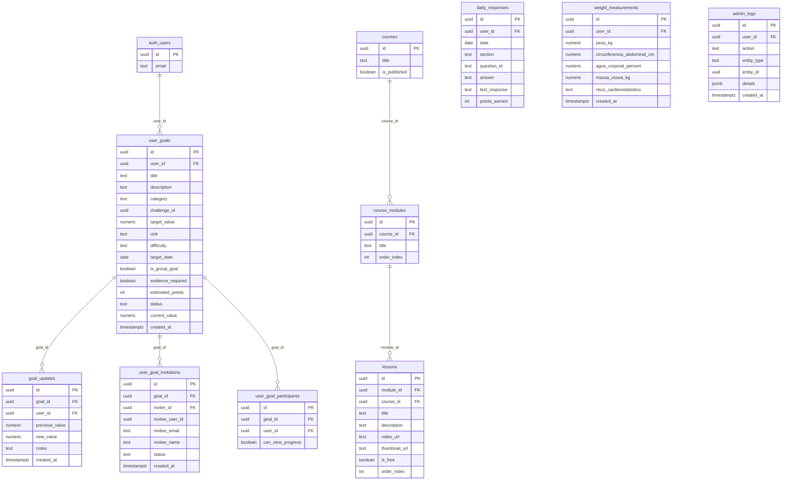

### Supabase Schema & Policies

This document summarizes key tables, relationships, policies, and storage buckets as defined in `supabase/migrations/*`.

#### ERD (selected)

#### RLS Highlights
- sessions: SELECT aberto; INSERT/UPDATE/DELETE somente admin via `auth.jwt()->'app_metadata'->>'role' = 'admin'` ou `user_metadata` (see 20250730103000_fix_policies_and_sections.sql).
- lessons: leitura de publicadas; escrita somente admin.
- user_goal_invitations/participants: convidador e convidado; admin pode gerenciar.
- profiles: users veem/alteram o próprio; admins têm leitura global.

#### Storage Buckets
- `avatars` — user avatars; público leitura.
- `community-uploads` — uploads de feed; público leitura.
- `chat-images` — imagens do chat; público leitura; limite 5MB; mime `image/*`.
- `course-thumbnails` — capas/thumbnails de cursos e módulos; policies: select público, insert autenticado, update/delete admin.

See migrations: 20250730090000_configure_course_thumbnails_and_admin_logs.sql, 20250806000000_create_chat_images_bucket.sql and related duplicates (kept idempotent).

