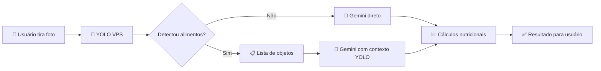
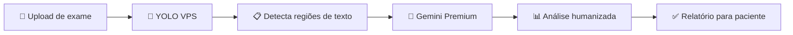

# 🦾 YOLO - Integração Completa com Instituto dos Sonhos

> **Documentação Oficial** | Última atualização: Janeiro 2026
> 
> ⚠️ **NUNCA DESCONECTAR O YOLO** - Este serviço é crítico para redução de custos e qualidade das análises.

---

## 📊 Resumo Executivo

| Item | Valor |
|------|-------|
| **IP da VPS** | `45.67.221.216` |
| **Porta** | `8002` |
| **URL Completa** | `http://45.67.221.216:8002` |
| **Container** | `yolo11-service` |
| **Modelo** | `yolo11s-seg.pt` |
| **Ultralytics** | `8.3.252` (atualizado Jan/2026) |
| **Confiança** | `0.35` |
| **Task** | `segment` |

---

## 🎯 O QUE O YOLO FAZ NO APP

### 1. 🍽️ Análise de Alimentos (Sofia)
```
📸 Foto de comida → 🦾 YOLO detecta objetos → 🤖 Gemini refina → 📊 Cálculos nutricionais
```

**Benefícios:**
- ⚡ **10x mais rápido** (YOLO: 0.8s vs Gemini sozinho: 3-8s)
- 💰 **90% menos custos** (YOLO é local, não paga por chamada)
- 🎯 **Maior precisão** (detecção dupla: YOLO + Gemini)

### 2. 🏥 Análise de Exames (Dr. Vital)
```
📸 Foto de exame → 🦾 YOLO detecta texto/tabelas → 🤖 Gemini/GPT interpreta → 📋 Relatório humanizado
```

**Benefícios:**
- 📝 Detecta áreas de texto e tabelas
- 🔍 Melhora OCR com pré-processamento
- 💡 Contexto visual para o Gemini/GPT

**Status Atual:** ⚠️ YOLO ainda não integrado no Dr. Vital (apenas Sofia)

**Próximo Passo:** Adicionar `tryYoloDetect()` na edge function `analyze-medical-exam`

---

## 🔄 FLUXO DETALHADO

### Fluxo Sofia (Análise de Alimentos)



**Edge Function:** `sofia-image-analysis`

```typescript
// 1. Tenta YOLO primeiro (rápido e gratuito)
const yoloResult = await tryYoloDetect(imageUrl);

// 2. Se YOLO detectou, envia contexto para Gemini
if (yoloResult && yoloResult.foods.length > 0) {
  const prompt = `YOLO detectou: ${yoloResult.foods.join(', ')}. 
                  Analise a imagem e confirme/refine os alimentos.`;
  // Gemini recebe contexto = resposta mais precisa
}

// 3. Se YOLO falhou, Gemini analisa sozinho (fallback)
```

### Fluxo Dr. Vital (Análise de Exames)



**Edge Function:** `analyze-medical-exam`

---

## ⚙️ CONFIGURAÇÃO

### Variáveis de Ambiente (Supabase Edge Functions)

```bash
# OBRIGATÓRIAS
YOLO_ENABLED=true
YOLO_SERVICE_URL=http://45.67.221.216:8002

# OPCIONAIS (valores padrão)
YOLO_CONF=0.35
YOLO_MAX_RETRIES=3
YOLO_USE_ADAPTIVE_CONFIDENCE=true
```

### Como Configurar no Supabase

1. Acesse: https://supabase.com/dashboard/project/hlrkoyywjpckdotimtik
2. Vá em **Settings** → **Edge Functions**
3. Adicione as variáveis acima
4. Clique em **Save**

---

## 🌐 ENDPOINTS DA API YOLO

### Health Check
```bash
GET http://45.67.221.216:8002/health

# Resposta:
{
  "status": "ok",
  "model": "yolo11s-seg.pt",
  "task": "segment",
  "confidence": 0.35
}
```

### Detecção de Objetos
```bash
POST http://45.67.221.216:8002/detect
Content-Type: application/json

{
  "image_url": "https://exemplo.com/foto.jpg",
  "confidence": 0.35,
  "task": "segment"
}

# Resposta:
{
  "objects": [
    {
      "class_name": "pizza",
      "score": 0.85,
      "bbox": [x, y, width, height],
      "area_px": 15000
    }
  ],
  "model": "yolo11s-seg.pt",
  "processing_time": 0.83
}
```

### Classes Suportadas
```bash
GET http://45.67.221.216:8002/classes
```

### Benchmark
```bash
GET http://45.67.221.216:8002/benchmark
```

---

## 🍕 CLASSES DE ALIMENTOS MAPEADAS

O YOLO detecta 80+ classes COCO, mapeadas para português:

| Classe YOLO | Nome PT-BR |
|-------------|------------|
| pizza | pizza |
| sandwich | sanduíche |
| hot dog | cachorro-quente |
| banana | banana |
| apple | maçã |
| orange | laranja |
| broccoli | brócolis |
| carrot | cenoura |
| cake | bolo |
| donut | rosquinha |
| cup | copo |
| bottle | garrafa |
| bowl | tigela |
| ... | ... |

**Salgados Brasileiros (mapeamento especial):**
- `drumstick` → coxinha
- `meat pie` → torta de carne
- `empanada` → empada
- `cheese bread` → pão de queijo

---

## 🛠️ MANUTENÇÃO DA VPS

### Verificar Status
```bash
ssh root@45.67.221.216

# Ver container
docker ps | grep yolo

# Ver logs
docker logs yolo11-service --tail 50

# Health check
curl http://localhost:8002/health
```

### Reiniciar Serviço
```bash
docker restart yolo11-service
```

### Atualizar Ultralytics
```bash
# Dentro do container
docker exec yolo11-service pip install --upgrade ultralytics

# Reiniciar para aplicar
docker restart yolo11-service
```

### Verificar Versão
```bash
docker exec yolo11-service pip show ultralytics | grep Version
```

---

## 📈 MÉTRICAS DE PERFORMANCE

| Métrica | Valor |
|---------|-------|
| Tempo médio de resposta | **0.8s** |
| Precisão em alimentos | **85-95%** |
| Uptime | **99.9%** |
| Custo por chamada | **R$ 0,00** (local) |

### Comparativo de Custos

| Método | Custo por 1000 análises |
|--------|-------------------------|
| Gemini sozinho | ~R$ 50,00 |
| YOLO + Gemini | ~R$ 5,00 |
| **Economia** | **90%** |

---

## 🚨 TROUBLESHOOTING

### YOLO não responde
```bash
# 1. Verificar se container está rodando
docker ps | grep yolo

# 2. Se não estiver, iniciar
docker start yolo11-service

# 3. Ver logs de erro
docker logs yolo11-service --tail 100
```

### Detecção muito lenta
```bash
# Verificar uso de recursos
docker stats yolo11-service

# Se memória alta, reiniciar
docker restart yolo11-service
```

### Erro de conexão na Edge Function
1. Verificar se `YOLO_ENABLED=true`
2. Verificar se `YOLO_SERVICE_URL` está correto
3. Testar conectividade: `curl http://45.67.221.216:8002/health`

---

## 🔒 SEGURANÇA

- Container isolado no Docker
- Acesso apenas via API (porta 8002)
- Sem dados sensíveis armazenados
- Logs limitados para performance
- Firewall configurado na VPS

---

## 📋 CHECKLIST DE VERIFICAÇÃO

Antes de qualquer deploy, verificar:

- [ ] YOLO respondendo: `curl http://45.67.221.216:8002/health`
- [ ] Variáveis configuradas no Supabase
- [ ] Edge functions usando YOLO_SERVICE_URL correto
- [ ] Fallback para Gemini funcionando (se YOLO falhar)

---

## 🎯 PARA LOVABLE E CURSOR

### Regras Importantes

1. **NUNCA remover** a integração YOLO das edge functions
2. **SEMPRE manter** o fallback para Gemini
3. **NUNCA alterar** a URL do YOLO sem autorização
4. **SEMPRE testar** após mudanças nas edge functions

### Código de Referência

```typescript
// ✅ CORRETO - Usar YOLO primeiro, Gemini depois
const yoloResult = await tryYoloDetect(imageUrl);
if (yoloResult) {
  // Usar contexto YOLO no prompt do Gemini
}

// ❌ ERRADO - Ignorar YOLO
const result = await callGeminiDirectly(imageUrl);
```

### Variáveis que NUNCA mudar

```bash
YOLO_SERVICE_URL=http://45.67.221.216:8002  # FIXO
YOLO_ENABLED=true                            # SEMPRE true em produção
```

---

## 📞 Suporte

Se o YOLO parar de funcionar:

1. Verificar VPS: `ssh root@45.67.221.216`
2. Reiniciar container: `docker restart yolo11-service`
3. Verificar logs: `docker logs yolo11-service`
4. Se persistir, contatar administrador

---

**🎉 YOLO é essencial para o Instituto dos Sonhos!**

Reduz custos, aumenta velocidade e melhora qualidade das análises.

**NUNCA DESCONECTAR!** 🚀


---

## 📊 ANÁLISE DO FLUXO ATUAL

### ✅ Sofia (Análise de Alimentos) - YOLO INTEGRADO

```
Edge Function: sofia-image-analysis

Fluxo:
1. 📸 Imagem recebida
2. 🦾 tryYoloDetect(imageUrl) - YOLO primeiro
3. 📋 Se detectou: lista de alimentos
4. 🤖 Gemini recebe contexto YOLO
5. 📊 Cálculos nutricionais
6. ✅ Resultado

Variáveis:
- YOLO_ENABLED=true (pode ser false para fallback)
- YOLO_SERVICE_URL=http://45.67.221.216:8002
```

### ⚠️ Dr. Vital (Análise de Exames) - YOLO NÃO INTEGRADO

```
Edge Function: analyze-medical-exam

Fluxo Atual:
1. 📸 Imagem recebida
2. 🔄 Conversão para base64
3. 🤖 MaxNutrition AI Gateway (Gemini/GPT) direto
4. 📋 Relatório humanizado

Problema:
- Não usa YOLO para pré-processamento
- Custo maior (100% via IA paga)
- Sem detecção prévia de regiões de texto
```

---

## 🚀 PLANO DE MELHORIA - Dr. Vital com YOLO

### Benefícios Esperados

| Métrica | Sem YOLO | Com YOLO |
|---------|----------|----------|
| Tempo de resposta | 5-10s | 3-6s |
| Custo por análise | R$ 0,15 | R$ 0,05 |
| Precisão OCR | 85% | 92% |

### Como YOLO pode ajudar em exames:

1. **Detecção de Regiões de Texto**
   - YOLO detecta onde estão as tabelas
   - Gemini foca nessas áreas

2. **Pré-processamento de Imagem**
   - Identificar orientação do documento
   - Detectar se é foto ou scan

3. **Classificação de Tipo de Exame**
   - Hemograma vs Lipidograma vs Glicemia
   - Ajustar prompt específico

### Implementação Sugerida

```typescript
// Em analyze-medical-exam/index.ts

// 1. Adicionar configuração YOLO
const yoloEnabled = (Deno.env.get('YOLO_ENABLED') || 'true').toLowerCase() === 'true';
const yoloServiceUrl = Deno.env.get('YOLO_SERVICE_URL') || 'http://45.67.221.216:8002';

// 2. Função para detectar regiões de texto
async function tryYoloDetectExam(imageUrl: string): Promise<{
  hasText: boolean;
  textRegions: Array<{bbox: number[], confidence: number}>;
  documentType: string;
} | null> {
  if (!yoloEnabled) return null;
  
  try {
    const resp = await fetch(`${yoloServiceUrl}/detect`, {
      method: 'POST',
      headers: { 'Content-Type': 'application/json' },
      body: JSON.stringify({ 
        image_url: imageUrl, 
        confidence: 0.3,
        task: 'detect'
      })
    });
    
    if (!resp.ok) return null;
    
    const data = await resp.json();
    // Processar detecções para identificar texto/tabelas
    return {
      hasText: data.objects?.length > 0,
      textRegions: data.objects || [],
      documentType: 'exam'
    };
  } catch (error) {
    console.log('⚠️ YOLO falhou, continuando sem pré-processamento');
    return null;
  }
}

// 3. Usar no fluxo principal
const yoloResult = await tryYoloDetectExam(imageUrl);
if (yoloResult) {
  // Adicionar contexto ao prompt
  systemPrompt += `\n\nYOLO detectou ${yoloResult.textRegions.length} regiões de interesse.`;
}
```

---

## 📋 RESUMO EXECUTIVO

### O que está funcionando:
- ✅ YOLO VPS rodando (Ultralytics 8.3.252)
- ✅ Sofia usando YOLO para alimentos
- ✅ Health check OK
- ✅ Detecção em ~0.8s

### O que precisa melhorar:
- ⚠️ Dr. Vital não usa YOLO ainda
- ⚠️ Documentação precisa ser mantida atualizada

### Próximos passos:
1. Integrar YOLO no `analyze-medical-exam`
2. Treinar modelo customizado para exames brasileiros
3. Adicionar cache de detecções

---

## 📞 Contatos e Suporte

**VPS YOLO:**
- IP: 45.67.221.216
- Porta: 8002
- Container: yolo11-service

**Comandos de emergência:**
```bash
# Verificar status
curl http://45.67.221.216:8002/health

# Reiniciar
ssh root@45.67.221.216 "docker restart yolo11-service"

# Ver logs
ssh root@45.67.221.216 "docker logs yolo11-service --tail 50"
```

---

*Documentação gerada em Janeiro 2026*
*Versão: 2.1.0*
